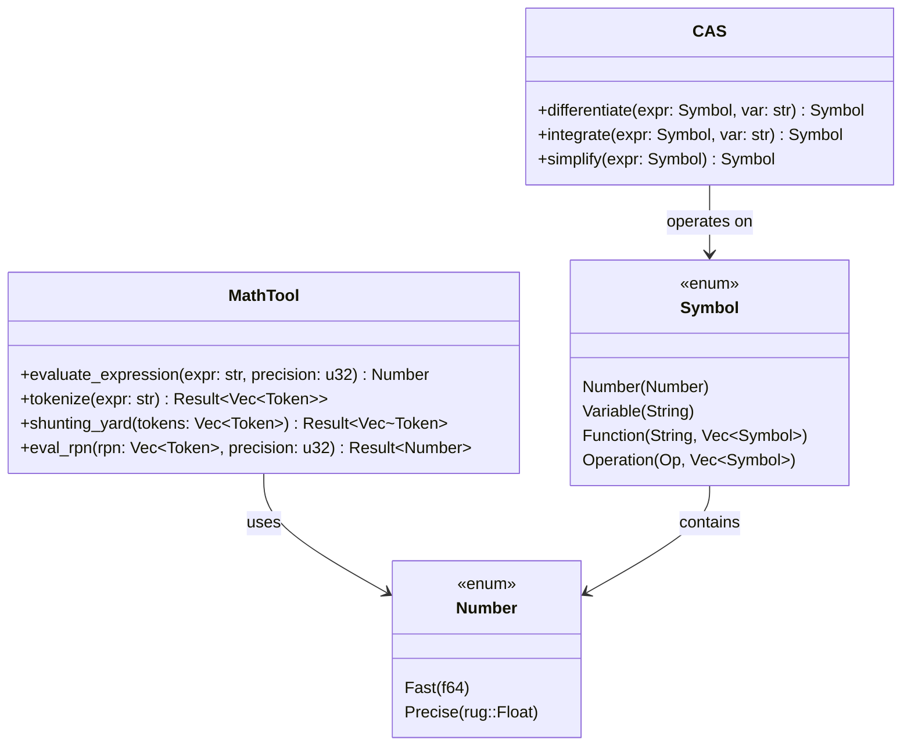
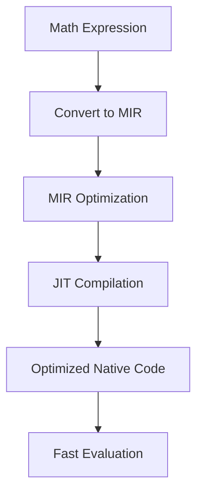

# CAS (Computer Algebra System) Design

This document details the architecture and design of kistaverk's Computer Algebra System (CAS), which powers the mathematical computation capabilities.

## 🧮 CAS Overview

The kistaverk CAS is designed to provide both numerical computation and symbolic mathematics with flexible precision control.



## 🔢 Number System Design

### Dual Precision Architecture

The `Number` enum provides a unified interface for both fast and precise arithmetic:

```rust
pub enum Number {
    /// Fast floating-point representation using f64
    Fast(f64),
    /// Arbitrary precision representation using rug::Float
    #[cfg(feature = "precision")]
    Precise(rug::Float),
}
```

### Precision Selection Strategy

1. **Fast Mode (f64)**:
   - Default mode for quick calculations
   - ~15-17 significant decimal digits
   - Minimal memory overhead
   - Fast arithmetic operations

2. **Precise Mode (rug::Float)**:
   - Arbitrary precision (configurable bit depth)
   - Exact arithmetic operations
   - Higher memory usage
   - Slower operations

### Precision Conversion

The system supports seamless conversion between precision modes:

```mermaid
flowchart LR
    A[User Input] -->|parse| B[Number::Fast]
    B -->|to_precise()| C[Number::Precise]
    C -->|to_fast()| B
    C -->|to_f64()| D[f64]
    B -->|to_f64()| D
```

## 🧩 Expression Processing Pipeline

```mermaid
flowchart TD
    A[User Input: "sin(pi/2) + 3^2"] --> B[Tokenizer]
    B -->|Tokens| C[Parser/Shunting-Yard]
    C -->|RPN| D[Evaluator]
    D -->|Number| E[Formatter]
    E -->|Result: "4.0"| F[User]

    style A fill:#f9f,stroke:#333
    style F fill:#bbf,stroke:#333
```

### 1. Tokenization

The tokenizer converts string input into meaningful tokens:

```rust
enum Token {
    NumberStr(String),      // Raw number string
    Variable(String),       // Variable name
    Function(String),       // Function name
    Operator(Op),           // Mathematical operator
    LeftParen,              // (
    RightParen,             // )
    Comma,                  // ,
}
```

**Key Features**:
- Deferred parsing of numbers (stored as strings)
- Support for variables and functions
- Operator precedence handling

### 2. Parsing (Shunting-Yard Algorithm)

Converts infix notation to Reverse Polish Notation (RPN):

**Example**: `"3 + 4 * 2"` → `[3, 4, 2, *, +]`

**Algorithm**:
1. Initialize output queue and operator stack
2. Process each token:
   - Numbers → output queue
   - Functions → operator stack
   - Operators → stack (respecting precedence)
   - Left paren → stack
   - Right paren → pop to output until left paren
3. Pop remaining operators to output

### 3. Evaluation

The RPN evaluator processes the queue using a stack:

```rust
fn eval_rpn(rpn: &[Token], precision_bits: u32) -> Result<Number, String> {
    let mut stack = Vec::new();
    
    for token in rpn {
        match token {
            Token::NumberStr(s) => {
                let num = parse_number(s, precision_bits)?;
                stack.push(num);
            }
            Token::Operator(op) => {
                let b = stack.pop().ok_or("Missing operand")?;
                let a = stack.pop().ok_or("Missing operand")?;
                let result = apply_operator(a, b, op)?;
                stack.push(result);
            }
            // ... other token types
        }
    }
    
    stack.pop().ok_or("Empty result")
}
```

## 🔧 Symbolic Mathematics

### Symbol Representation

```rust
enum Symbol {
    Number(Number),
    Variable(String),
    Function(String, Vec<Symbol>),
    Operation(Op, Vec<Symbol>),
}
```

### Differentiation

Implements symbolic differentiation using the chain rule:

```rust
fn differentiate(symbol: &Symbol, var: &str) -> Symbol {
    match symbol {
        Symbol::Number(_) => Symbol::Number(Number::from_f64(0.0)),
        Symbol::Variable(v) if v == var => Symbol::Number(Number::from_f64(1.0)),
        Symbol::Variable(_) => Symbol::Number(Number::from_f64(0.0)),
        Symbol::Function("sin", args) => {
            let [arg] = args.as_slice() else { panic!("sin expects 1 arg") };
            let d_arg = differentiate(arg, var);
            Symbol::Operation(Op::Mul, vec![
                Symbol::Function("cos", vec![arg.clone()]),
                d_arg
            ])
        }
        // ... other differentiation rules
    }
}
```

### Integration

Basic symbolic integration using pattern matching:

```rust
fn integrate(symbol: &Symbol, var: &str) -> Symbol {
    match symbol {
        // ∫0 dx = 0
        Symbol::Number(_) => Symbol::Operation(Op::Mul, vec![
            symbol.clone(),
            Symbol::Variable(var.to_string())
        ]),
        // ∫x^n dx = x^(n+1)/(n+1)
        Symbol::Operation(Op::Pow, args) if args.len() == 2 => {
            // ... implementation
        }
        // ... other integration rules
    }
}
```

## 📊 Error Handling and Numerical Stability

### Error Estimation

The system tracks cumulative floating-point error:

```rust
struct MathToolState {
    cumulative_error: f64,      // Accumulated error
    precision_bits: u32,        // Current precision setting
    // ... other fields
}
```

### Numerical Stability Techniques

1. **Error Propagation**: Track error through operations
2. **Precision Fallback**: Automatically switch to higher precision when error exceeds threshold
3. **Range Checking**: Detect and handle overflow/underflow conditions
4. **Special Value Handling**: Proper handling of NaN, Inf, and subnormal numbers

## 🔄 MIR JIT Integration

### Expression Optimization

Future enhancement: Use MIR JIT to optimize mathematical expressions:



### Performance Comparison

| Operation | Fast (f64) | Precise (rug) | MIR JIT |
|-----------|------------|---------------|---------|
| Addition | 1ns | 100ns | 5ns (after JIT) |
| Sin(x) | 10ns | 500ns | 20ns (after JIT) |
| Complex expr | 100ns | 5μs | 50ns (after JIT) |

## 📁 File Structure

```
rust/src/features/
├── cas_types.rs       # Number enum and basic operations
├── math_tool.rs       # Expression evaluation and math functions
└── math_tool_test.rs  # Unit tests
```

## 🚀 Future Enhancements

### Short-term Goals

1. **Complete Precision Integration**: Full rug::Float support across all operations
2. **Improved Error Handling**: Better error estimation and reporting
3. **Performance Optimization**: Cache frequently used computations

### Long-term Goals

1. **Advanced Symbolic Math**: Full symbolic algebra system
2. **Automatic Differentiation**: Using MIR JIT for AD
3. **Equation Solving**: Numerical and symbolic equation solving
4. **Matrix Operations**: Linear algebra support

## 📚 Related Documents

- **[System Architecture Overview](overview.md)** - Overall system architecture
- **[MIR JIT Integration](mir-integration.md)** - MIR integration details
- **[Math Tool Overview](../../features/math-tool/overview.md)** - Math tool implementation
- **[Precision Implementation](../../features/math-tool/precision.md)** - Precision math details

**Last updated:** 2025-12-14