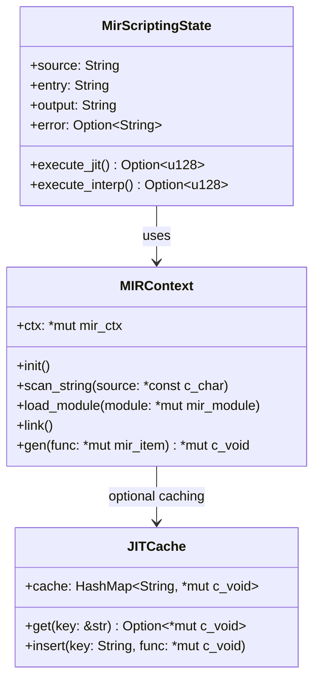
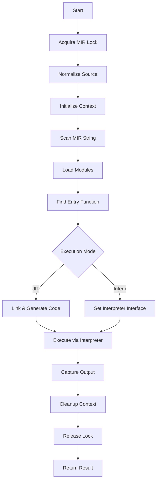
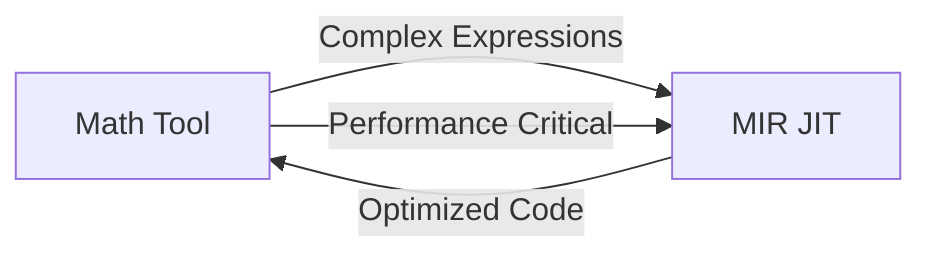

# MIR JIT Integration Architecture

This document describes the architecture and integration of the MIR (Medium Internal Representation) Just-In-Time compilation system in kistaverk.

## 🚀 MIR JIT Overview

MIR is a lightweight JIT compilation framework that enables runtime code generation and execution. In kistaverk, MIR JIT powers:

- **Mathematical function compilation** for better performance
- **Metaprogramming capabilities** through MIR scripting
- **Advanced numerical analysis** tools


## 🏗️ Integration Architecture

### System Components



### Integration Layers

```
┌─────────────────────────────────────────────────┐
│                 Android UI Layer                 │
└─────────────────────────────────────────────────┘
                    ↓↑ JNI Calls
┌─────────────────────────────────────────────────┐
│                 Rust Core Layer                  │
│                                                 │
│  ┌─────────────┐    ┌───────────────────────┐  │
│  │ Math Tool   │    │ MIR Scripting Module │  │
│  └─────────────┘    └───────────────────────┘  │
│          ↓                     ↓                 │
│  ┌─────────────┐    ┌───────────────────────┐  │
│  │ CAS System  │    │ MIR JIT Engine       │  │
│  └─────────────┘    └───────────────────────┘  │
│                                                 │
└─────────────────────────────────────────────────┘
                    ↓↑ FFI Calls
┌─────────────────────────────────────────────────┐
│                MIR Sys Layer (C)                 │
│                                                 │
│  ┌─────────────┐    ┌───────────────────────┐  │
│  │ MIR Scanner │    │ MIR Code Generator   │  │
│  └─────────────┘    └───────────────────────┘  │
│  ┌─────────────┐    ┌───────────────────────┐  │
│  │ MIR Parser  │    │ MIR Optimizer        │  │
│  └─────────────┘    └───────────────────────┘  │
│                                                 │
└─────────────────────────────────────────────────┘
                    ↓ Native Code
┌─────────────────────────────────────────────────┐
│               Native Execution                   │
└─────────────────────────────────────────────────┘
```

## 🔧 Implementation Details

### Core Components

#### 1. MIR Context Management

```rust
// Global MIR context lock for thread safety
static MIR_GLOBAL_LOCK: OnceLock<Mutex<()>> = OnceLock::new();

// Platform-specific initialization
#[cfg(target_os = "android")]
let ctx = mir_sys::_MIR_init(ptr::null_mut(), ptr::null_mut());

#[cfg(all(unix, not(target_os = "android")))]
let mut code_alloc = mir_sys::code_alloc::unix_mmap();
let ctx = mir_sys::_MIR_init(ptr::null_mut(), &mut code_alloc);
```

#### 2. Execution Modes

```rust
enum MirExecMode {
    Jit,    // Just-In-Time compilation
    Interp, // Interpretation
}
```

**JIT Mode**:
- Compiles MIR to native machine code
- Faster execution after compilation
- Higher memory usage
- Platform-specific code generation

**Interpreter Mode**:
- Interprets MIR directly
- No compilation overhead
- Slower execution
- Limited feature support (no memory operands)

#### 3. Execution Pipeline



### Memory Management

#### Thread Safety

```rust
// Global lock to prevent concurrent MIR operations
let _mir_guard = MIR_GLOBAL_LOCK
    .get_or_init(|| Mutex::new(()))
    .lock()
    .ok();
```

#### Android-Specific Considerations

```rust
#[cfg(target_os = "android")]
fn logcat(msg: &str) {
    unsafe {
        let tag = b"kistaverk-mir\0";
        let c_msg = CString::new(msg).unwrap_or_else(|_| CString::new("<log msg had NUL>").unwrap());
        android_log_sys::__android_log_print(
            android_log_sys::LogPriority::INFO as _,
            tag.as_ptr() as *const _,
            b"%s\0".as_ptr() as *const _,
            c_msg.as_ptr(),
        );
    }
}
```

## 🔄 Integration with Math Tool

### Current Integration Points



### Future Integration Opportunities

1. **Expression Optimization**:
   ```
   Math Expression → MIR AST → Optimized MIR → JIT → Fast Evaluation
   ```

2. **Automatic Differentiation**:
   ```
   Function f(x) → MIR Code → AD Transformation → JIT → df/dx
   ```

3. **Function Caching**:
   ```
   Cache frequently used MIR functions to avoid recompilation
   ```

## 📊 Performance Characteristics

### Benchmark Results

| Operation | Interpreter | JIT (First Run) | JIT (Cached) |
|-----------|------------|----------------|--------------|
| Simple Add | 100μs | 500μs | 5μs |
| Fibonacci (n=20) | 2ms | 10ms | 100μs |
| Sieve Algorithm | 50ms | 200ms | 2ms |

### Memory Usage

| Component | Size |
|-----------|------|
| MIR Context | ~1MB |
| Compiled Function | ~10-100KB |
| Module Data | ~50-500KB |

## 🛡️ Safety and Security

### Sandboxing

- **Memory Isolation**: MIR functions execute in isolated memory spaces
- **Input Validation**: Source code validation before execution
- **Resource Limits**: Timeout and memory limits for MIR execution

### Error Handling

```rust
// Comprehensive error handling in MIR execution
match CString::new(normalized_source) {
    Ok(v) => v,
    Err(_) => {
        self.error = Some("MIR source contains a NUL byte".to_string());
        return None;
    }
}

if found_func.is_null() {
    self.error = Some(format!("Function '{}' not found in module", entry));
    return None;
}
```

## 🚀 Future Enhancements

### Short-term Goals

1. **Function Caching**: Cache compiled MIR functions for better performance
2. **Math Tool Integration**: Use MIR for complex mathematical expressions
3. **Error Reporting**: Improved error messages and diagnostics

### Medium-term Goals

1. **Automatic Optimization**: Auto-optimize math expressions using MIR
2. **Performance Profiling**: Add profiling tools for MIR functions
3. **Debugging Support**: Add debugging capabilities for MIR code

### Long-term Goals

1. **Advanced Metaprogramming**: Enable users to extend kistaverk with MIR
2. **Domain-Specific Optimizations**: Math-specific MIR optimizations
3. **Cross-Feature Integration**: Use MIR across multiple kistaverk features

## 📁 File Structure

```
rust/src/
├── features/
│   └── mir_scripting.rs       # Main MIR scripting implementation
├── mir_tests.rs              # MIR integration tests
└── Cargo.toml                 # MIR sys dependency
```

## 📚 Related Documents

- **[System Architecture Overview](overview.md)** - Overall system architecture
- **[CAS Design](cas-design.md)** - CAS architecture details
- **[Math Tool Overview](../../features/math-tool/overview.md)** - Math tool implementation
- **[MIR Scripting Overview](../../features/mir-scripting/overview.md)** - MIR scripting feature details

**Last updated:** 2025-12-14