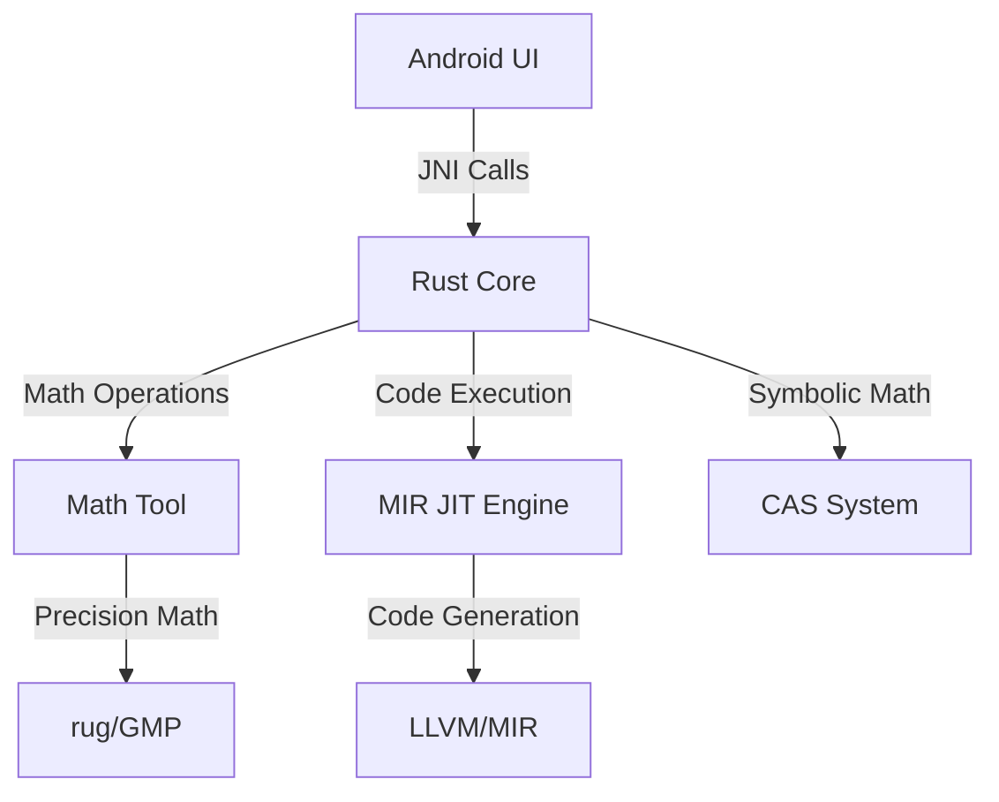
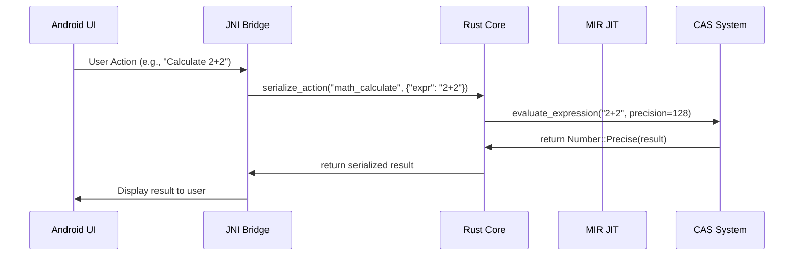

# System Architecture Overview

This document provides a high-level overview of kistaverk's system architecture, focusing on the core components and their interactions.

## 🏗️ Core Architecture

Kistaverk is a modular Android application built with Rust at its core, providing advanced mathematical and computational capabilities through a JNI bridge.



## 🔧 Main Components

### 1. Android Frontend

- **Kotlin/Java UI**: Native Android interface using Jetpack Compose
- **JNI Bridge**: Connects Android UI to Rust core functionality
- **State Management**: Handles application state and user interactions

### 2. Rust Core (kistaverk_core)

The heart of kistaverk, implemented as a Rust CDylib:

- **Math Tool**: Mathematical expression evaluation and computation
- **MIR JIT Engine**: Just-In-Time compilation for MIR language
- **CAS System**: Computer Algebra System for symbolic mathematics
- **Feature Modules**: Various computational tools and utilities

### 3. External Dependencies

- **GMP/MPFR/MPC**: Arbitrary precision arithmetic (via rug)
- **MIR**: Lightweight JIT compilation framework
- **Serde/JSON**: Data serialization for UI communication

## 🔄 Data Flow



## 📦 Module Structure

```
rust/src/
├── features/              # Feature implementations
│   ├── math_tool.rs       # Mathematical computation
│   ├── mir_scripting.rs   # MIR JIT integration
│   ├── cas_types.rs       # CAS type definitions
│   └── ...                # Other features
├── state.rs              # Application state management
├── router.rs             # Action routing system
└── lib.rs                # JNI interface and entry point
```

## 🎯 Key Architectural Decisions

### 1. Rust Core with JNI Bridge

**Rationale**: Rust provides memory safety, performance, and cross-platform compatibility while allowing access to Android's Java/Kotlin ecosystem.

**Trade-offs**:
- ✅ Memory safety and performance
- ✅ Access to Rust's rich ecosystem
- ❌ JNI overhead for frequent calls
- ❌ Complex build setup for Android

### 2. Modular Feature Design

Each feature is implemented as a separate module with:
- **State management**: Feature-specific state
- **UI rendering**: JSON-based UI description
- **Action handling**: Feature-specific actions

**Benefits**:
- Easy to add new features
- Clear separation of concerns
- Independent testing

### 3. Dual Precision System

The `Number` enum supports both:
- **Fast mode**: `f64` for quick calculations
- **Precise mode**: `rug::Float` for arbitrary precision

**Implementation**:
```rust
enum Number {
    Fast(f64),
    #[cfg(feature = "precision")]
    Precise(rug::Float),
}
```

## 🔧 Performance Considerations

### MIR JIT Compilation

- **Compilation Overhead**: JIT compilation adds initial latency
- **Execution Speed**: JIT-compiled code runs at native speed
- **Memory Usage**: Compiled functions consume additional memory

### Precision Math

- **f64 Mode**: Fast, but limited to ~15 decimal digits
- **rug Mode**: Arbitrary precision, but slower and larger memory footprint

## 🛡️ Safety and Security

### Memory Safety

- **Rust Core**: Memory-safe by design
- **JNI Boundary**: Careful handling of pointers and buffers
- **MIR JIT**: Sandboxed execution environment

### Error Handling

- **Comprehensive Error Types**: Specific error types for different subsystems
- **Graceful Degradation**: Fallback mechanisms for unsupported operations
- **User Feedback**: Clear error messages in the UI

## 🚀 Future Architecture Evolution

### Planned Enhancements

1. **Enhanced MIR Integration**:
   - Function caching for better performance
   - Automatic expression optimization
   - Advanced numerical analysis

2. **Improved CAS System**:
   - Symbolic simplification
   - Automatic differentiation
   - Equation solving

3. **Better Android Integration**:
   - Reduced JNI overhead
   - Improved build system
   - Better error reporting

## 📚 Related Documents

- **[CAS Design](cas-design.md)** - Detailed CAS architecture
- **[MIR JIT Integration](mir-integration.md)** - MIR integration details
- **[Math Tool Overview](../../features/math-tool/overview.md)** - Math tool implementation
- **[MIR Scripting Overview](../../features/mir-scripting/overview.md)** - MIR scripting details

**Last updated:** 2025-12-14