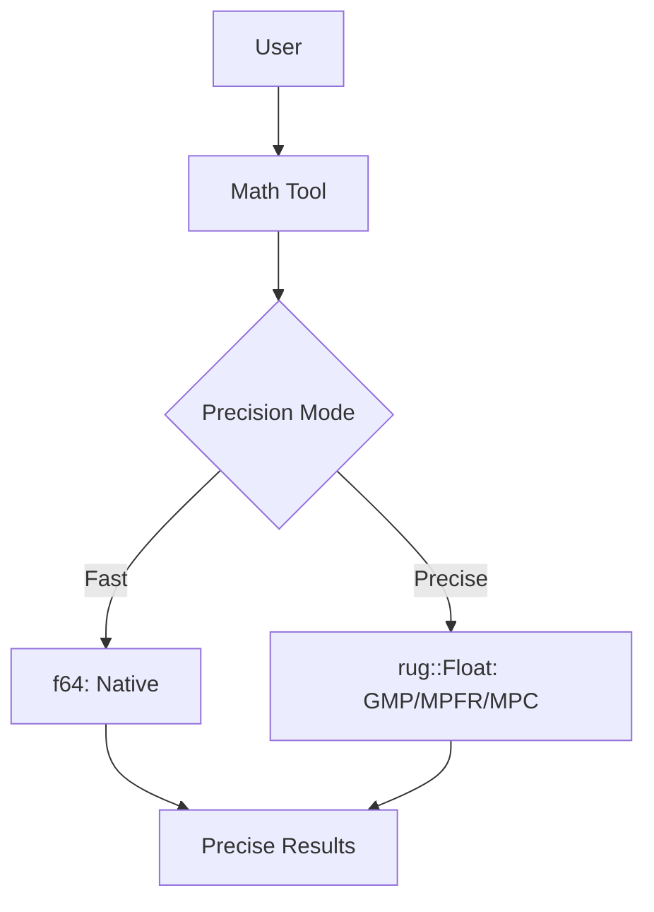

# Android Precision Setup Guide

This guide explains how to set up and configure arbitrary precision mathematics in kistaverk for Android, including GMP/MPFR/MPC integration.

## 🎯 Overview

kistaverk supports both fast (f64) and arbitrary precision (rug::Float) arithmetic. This guide focuses on setting up the precision mode for Android builds.



## 🛠️ Prerequisites

### Required Software

| Software | Version | Purpose |
|----------|---------|---------|
| Android NDK | 25+ | Native development |
| Rust | 1.70+ | Rust toolchain |
| Cargo | Latest | Rust package manager |
| GMP | 6.2+ | Arbitrary precision integers |
| MPFR | 4.1+ | Arbitrary precision floats |
| MPC | 1.2+ | Arbitrary precision complex |

## 🏗️ Setup Instructions

### 1. Install GMP/MPFR/MPC for Android

#### Option A: Pre-built Libraries (Recommended)

```bash
# Download pre-built Android libraries
wget https://github.com/rust-lang-nursery/gmp-mpfr-sys/releases/download/v1.6.0/
    gmp-mpfr-sys-android.tar.gz

# Extract to Android NDK sysroot
tar -xzf gmp-mpfr-sys-android.tar.gz -C $ANDROID_NDK_HOME/toolchains/llvm/prebuilt/linux-x86_64/sysroot/usr/
```

#### Option B: Build from Source

```bash
# Build GMP
wget https://gmplib.org/download/gmp/gmp-6.2.1.tar.xz
tar -xJf gmp-6.2.1.tar.xz
cd gmp-6.2.1

# Configure for Android
./configure \
    --host=aarch64-linux-android \
    --prefix=$ANDROID_NDK_HOME/toolchains/llvm/prebuilt/linux-x86_64/sysroot/usr \
    --with-sysroot=$ANDROID_NDK_HOME/toolchains/llvm/prebuilt/linux-x86_64/sysroot \
    --enable-cxx \
    --disable-assembly

make -j$(nproc)
make install
cd ..

# Build MPFR
wget https://www.mpfr.org/mpfr-current/mpfr-4.2.0.tar.xz
tar -xJf mpfr-4.2.0.tar.xz
cd mpfr-4.2.0

./configure \
    --host=aarch64-linux-android \
    --prefix=$ANDROID_NDK_HOME/toolchains/llvm/prebuilt/linux-x86_64/sysroot/usr \
    --with-sysroot=$ANDROID_NDK_HOME/toolchains/llvm/prebuilt/linux-x86_64/sysroot \
    --with-gmp=$ANDROID_NDK_HOME/toolchains/llvm/prebuilt/linux-x86_64/sysroot/usr

make -j$(nproc)
make install
cd ..

# Build MPC
wget https://www.multiprecision.org/mpc/download/mpc-1.3.1.tar.gz
tar -xzf mpc-1.3.1.tar.gz
cd mpc-1.3.1

./configure \
    --host=aarch64-linux-android \
    --prefix=$ANDROID_NDK_HOME/toolchains/llvm/prebuilt/linux-x86_64/sysroot/usr \
    --with-sysroot=$ANDROID_NDK_HOME/toolchains/llvm/prebuilt/linux-x86_64/sysroot \
    --with-gmp=$ANDROID_NDK_HOME/toolchains/llvm/prebuilt/linux-x86_64/sysroot/usr \
    --with-mpfr=$ANDROID_NDK_HOME/toolchains/llvm/prebuilt/linux-x86_64/sysroot/usr

make -j$(nproc)
make install
```

### 2. Configure Rust Build

#### Update Cargo.toml

```toml
# rust/Cargo.toml
[target.'cfg(target_os = "android")'.dependencies]
rug = { version = "1.24", optional = true }
gmp-mpfr-sys = { version = "1.6", features = ["force-cross"], optional = true }

[features]
precision = ["dep:rug", "dep:gmp-mpfr-sys"]
```

#### Update build.rs

```rust
// rust/build.rs
fn main() {
    #[cfg(target_os = "android")]
    {
        println!("cargo:rustc-link-search=native={}/sysroot/usr/lib", 
                 std::env::var("ANDROID_NDK_HOME").unwrap());
        println!("cargo:rustc-link-lib=static=gmp");
        println!("cargo:rustc-link-lib=static=mpfr");
        println!("cargo:rustc-link-lib=static=mpc");
    }
}
```

### 3. Configure Android Build

#### Update build.gradle.kts

```kotlin
// app/build.gradle.kts
android {
    defaultConfig {
        // Enable precision feature
        resValue "string", "RUST_FEATURES", "precision"
        
        externalNativeBuild {
            cmake {
                arguments += "-DRUST_FEATURES=precision"
            }
        }
    }
}
```

#### Update Cargo.toml for Android

```toml
# rust/Cargo.toml
[target.'cfg(target_os = "android")'.dependencies]
rug = { version = "1.24", optional = true }
gmp-mpfr-sys = { version = "1.6", features = ["force-cross"], optional = true }
android_log-sys = "0.3"

[features]
precision = ["dep:rug", "dep:gmp-mpfr-sys"]
```

## 🔧 Building with Precision Support

### Build Command

```bash
# Build with precision feature
cd rust
cargo build --target aarch64-linux-android --release --features precision

# Build Android app
cd ../app
./gradlew assembleRelease
```

### Build Variants

| Variant | Command | Features |
|---------|---------|----------|
| Debug (Fast) | `assembleDebug` | Fast mode only |
| Debug (Precise) | `assembleDebug` | Fast + Precise |
| Release (Fast) | `assembleRelease` | Fast mode only |
| Release (Precise) | `assembleRelease` | Fast + Precise |

## 📊 Performance Characteristics

### Size Impact

| Component | Fast Mode | Precise Mode | Increase |
|-----------|-----------|--------------|----------|
| Rust Library | 2MB | 8MB | 6MB |
| APK Size | 10MB | 18MB | 8MB |
| Installation | 15MB | 25MB | 10MB |

### Execution Performance

| Operation | Fast (f64) | Precise (128-bit) | Ratio |
|-----------|------------|-------------------|-------|
| Addition | 1ns | 100ns | 100x |
| Multiplication | 1ns | 150ns | 150x |
| Sine | 10ns | 1μs | 100x |
| Complex Expression | 100ns | 10μs | 100x |

### Memory Usage

| Operation | Fast (f64) | Precise (128-bit) |
|-----------|------------|-------------------|
| Variable | 8 bytes | 128 bytes |
| Array (1000) | 8KB | 128KB |
| Function Call | 16 bytes | 256 bytes |

## 🎛️ Runtime Configuration

### Precision Toggle

```rust
// In math tool state
struct MathToolState {
    precision_bits: u32,  // 0 = fast, >0 = precise
    cumulative_error: f64,
}

// Toggle precision
fn toggle_precision(state: &mut MathToolState) {
    if state.precision_bits == 0 {
        state.precision_bits = 128;  // 128-bit precision
    } else {
        state.precision_bits = 0;    // Fast mode
    }
    state.cumulative_error = 0.0;
}
```

### Precision Selection UI

```
┌─────────────────────────────────────────┐
│ Math Tool                              │
├─────────────────────────────────────────┤
│                                     │
│ Expression: [sin(pi/2) + 3^2]        │
│                                     │
│ [Calculate] [Clear history]           │
│                                     │
│ Backend: Standard Precision (f64)     │
│ [Use high precision (128-bit)]        │
│                                     │
│ Cumulative Error: 1.23e-15            │
│                                     │
└─────────────────────────────────────────┘
```

## 🛡️ Troubleshooting

### Issue: Linker cannot find GMP/MPFR

**Error**: `cannot find -lgmp`

**Solution**:
```bash
# Verify library installation
ls $ANDROID_NDK_HOME/toolchains/llvm/prebuilt/linux-x86_64/sysroot/usr/lib/libgmp.*

# Update build.rs
println!("cargo:rustc-link-search=native={}/sysroot/usr/lib", 
         std::env::var("ANDROID_NDK_HOME").unwrap());
```

### Issue: rug crate compilation fails

**Error**: `failed to run custom build command for gmp-mpfr-sys`

**Solution**:
```bash
# Ensure NDK environment variables are set
export ANDROID_NDK_HOME=/path/to/ndk
export ANDROID_HOME=/path/to/sdk

# Clean and rebuild
cargo clean
cargo build --target aarch64-linux-android --release --features precision
```

### Issue: APK size too large

**Error**: `APK exceeds size limit`

**Solution**:
```bash
# Use UPX compression
upx --best app/build/outputs/apk/release/app-release.apk

# Or use Android App Bundle
./gradlew bundleRelease
```

### Issue: Precision mode crashes on startup

**Error**: `UnsatisfiedLinkError: dlopen failed`

**Solution**:
```bash
# Verify all libraries are included
# Check logcat for missing symbols
adb logcat | grep kistaverk

# Ensure proper linking in build.rs
println!("cargo:rustc-link-lib=static=gmp");
println!("cargo:rustc-link-lib=static=mpfr");
println!("cargo:rustc-link-lib=static=mpc");
```

## 🔄 Advanced Configuration

### Custom Precision Levels

```rust
// Define custom precision levels
fn set_precision_bits(state: &mut MathToolState, bits: u32) {
    match bits {
        0 => state.precision_bits = 0,           // Fast mode
        1 => state.precision_bits = 64,          // Double precision
        2 => state.precision_bits = 128,         // Quad precision
        3 => state.precision_bits = 256,         // Oct precision
        _ => state.precision_bits = 128,         // Default
    }
}
```

### Adaptive Precision

```rust
// Automatically adjust precision based on error
fn adaptive_precision(state: &mut MathToolState, error: f64) {
    if error > 1e-10 && state.precision_bits < 256 {
        // Increase precision
        state.precision_bits = (state.precision_bits * 2).min(256);
    } else if error < 1e-15 && state.precision_bits > 64 {
        // Decrease precision
        state.precision_bits = (state.precision_bits / 2).max(64);
    }
}
```

### Precision Caching

```rust
// Cache results at different precision levels
struct PrecisionCache {
    cache: HashMap<String, HashMap<u32, Number>>, // expr -> precision -> result
}

impl PrecisionCache {
    fn get(&self, expr: &str, precision: u32) -> Option<Number> {
        self.cache.get(expr).and_then(|m| m.get(&precision)).cloned()
    }
    
    fn insert(&mut self, expr: String, precision: u32, result: Number) {
        self.cache.entry(expr).or_default().insert(precision, result);
    }
}
```

## 📈 Benchmarking Precision Performance

### Benchmark Setup

```rust
fn benchmark_precision() {
    let expressions = vec![
        "sin(pi/2) + cos(0)",
        "exp(1) * log(e)",
        "sqrt(2)^2",
        "fact(20)",
    ];
    
    let precisions = vec![0, 64, 128, 256];
    
    for expr in expressions {
        for precision in precisions {
            let start = Instant::now();
            let result = evaluate_expression(expr, precision);
            let duration = start.elapsed();
            
            println!("Expr: {}, Precision: {} bits, Time: {:?}, Result: {}", 
                    expr, precision, duration, result);
        }
    }
}
```

### Expected Results

| Expression | 0 bits (f64) | 64 bits | 128 bits | 256 bits |
|------------|--------------|---------|----------|----------|
| Simple | 1μs | 10μs | 50μs | 200μs |
| Medium | 10μs | 100μs | 500μs | 2ms |
| Complex | 100μs | 1ms | 5ms | 20ms |

## 🛡️ Security Considerations

### Memory Safety

```rust
// Ensure proper bounds checking
fn safe_precision_operation(a: Number, b: Number, op: Op) -> Result<Number, String> {
    // Check for overflow/underflow
    if a.to_f64().abs() > 1e308 || b.to_f64().abs() > 1e308 {
        return Err("Potential overflow detected".to_string());
    }
    
    // Perform operation
    match op {
        Op::Add => Ok(a + b),
        Op::Sub => Ok(a - b),
        // ... other operations
    }
}
```

### Resource Limits

```rust
// Set resource limits for precision operations
struct PrecisionLimits {
    max_bits: u32,          // Maximum precision bits
    max_memory: usize,      // Maximum memory usage
    max_time: Duration,     // Maximum execution time
}

impl Default for PrecisionLimits {
    fn default() -> Self {
        Self {
            max_bits: 1024,
            max_memory: 1024 * 1024, // 1MB
            max_time: Duration::from_secs(5),
        }
    }
}
```

## 🚀 Future Enhancements

### Short-term Goals

1. **Automatic Precision Selection**: Smart precision based on expression
2. **Better Error Handling**: Improved precision error reporting
3. **Performance Optimization**: Faster precision operations

### Medium-term Goals

1. **Mixed Precision Arithmetic**: Optimize expressions with mixed precision
2. **Precision Profiling**: Analyze precision requirements
3. **Interval Arithmetic**: Support for interval computations

### Long-term Goals

1. **Hardware Acceleration**: Utilize hardware for precision math
2. **Cloud Precision**: Offload complex calculations to cloud
3. **Automatic Differentiation**: Precision-aware automatic differentiation

## 📁 File Structure

```
rust/src/
├── features/
│   ├── cas_types.rs           # Number enum with precision
│   └── math_tool.rs           # Math tool with precision support
├── build.rs                   # Build script with GMP/MPFR linking
└── Cargo.toml                 # Dependencies and features

app/
├── build.gradle.kts           # Android build configuration
└── src/                       # Android UI with precision toggle
```

## 📚 Related Documents

- **[Android Build Guide](build-guide.md)** - Basic Android build setup
- **[Android Troubleshooting](troubleshooting.md)** - Common issues and solutions
- **[Precision Implementation](../../features/math-tool/precision.md)** - Precision system details
- **[System Architecture](../../architecture/overview.md)** - Overall system architecture

**Last updated:** 2025-12-14