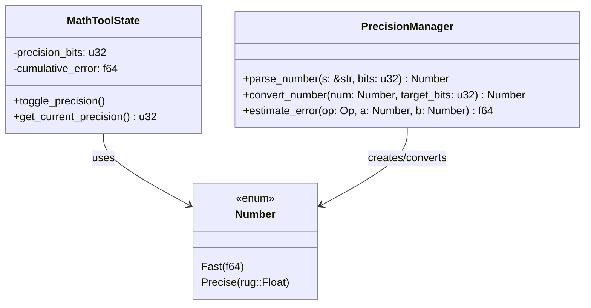

# Precision Implementation

This document details the precision system implementation in kistaverk's Math Tool, which provides both fast (f64) and arbitrary precision (rug::Float) arithmetic.

## 🎯 Precision System Overview



## 🔢 Number Type Implementation

### Core Number Enum

```rust
#[derive(Debug, PartialEq, Clone, Copy)]
pub enum Number {
    /// Fast floating-point representation using f64
    Fast(f64),
    /// Arbitrary precision representation using rug::Float
    #[cfg(feature = "precision")]
    Precise(rug::Float),
}
```

### Arithmetic Operations

All basic arithmetic operations are implemented for the `Number` type:

```rust
impl Add for Number {
    type Output = Self;
    
    fn add(self, rhs: Self) -> Self::Output {
        match (self, rhs) {
            (Number::Fast(a), Number::Fast(b)) => Number::Fast(a + b),
            #[cfg(feature = "precision")]
            (Number::Precise(a), Number::Precise(b)) => Number::Precise(a + b),
            #[cfg(feature = "precision")]
            (Number::Fast(a), Number::Precise(b)) => 
                Number::Precise(rug::Float::with_val(53, a) + b),
            #[cfg(feature = "precision")]
            (Number::Precise(a), Number::Fast(b)) => 
                Number::Precise(a + rug::Float::with_val(53, b)),
        }
    }
}
```

Similar implementations exist for `Sub`, `Mul`, `Div`, and `Neg`.

### Comparison Operations

```rust
impl PartialOrd for Number {
    fn partial_cmp(&self, other: &Self) -> Option<Ordering> {
        match (self, other) {
            (Number::Fast(a), Number::Fast(b)) => a.partial_cmp(b),
            #[cfg(feature = "precision")]
            (Number::Precise(a), Number::Precise(b)) => a.partial_cmp(b),
            #[cfg(feature = "precision")]
            (Number::Fast(a), Number::Precise(b)) => {
                let a_precise = rug::Float::with_val(53, *a);
                a_precise.partial_cmp(b)
            }
            #[cfg(feature = "precision")]
            (Number::Precise(a), Number::Fast(b)) => {
                let b_precise = rug::Float::with_val(53, *b);
                a.partial_cmp(&b_precise)
            }
        }
    }
}
```

## 🎛️ Precision Management

### Precision Settings

```rust
struct MathToolState {
    /// Current precision setting in bits
    /// 0 = fast mode (f64)
    /// >0 = precise mode with specified bits
    precision_bits: u32,
    
    /// Accumulated floating-point error
    cumulative_error: f64,
    
    /// Expression history
    history: Vec<MathHistoryEntry>,
}
```

### Precision Toggle

```rust
pub fn handle_math_action(state: &mut AppState, action: &str, bindings: &HashMap<String, String>) {
    match action {
        "math_toggle_precision" => {
            // Toggle between fast f64 and a safer high-precision default
            if state.math_tool.precision_bits == 0 {
                state.math_tool.precision_bits = 128;
            } else {
                state.math_tool.precision_bits = 0;
            }
            // Reset cumulative error when switching modes
            state.math_tool.cumulative_error = 0.0;
        }
        // ... other actions
    }
}
```

## 📊 Number Parsing

### String to Number Conversion

```rust
fn parse_number(s: &str, precision_bits: u32) -> Result<Number, String> {
    if precision_bits == 0 {
        // Fast mode: parse as f64
        s.parse::<f64>()
            .map(Number::Fast)
            .map_err(|e| format!("Failed to parse number: {}", e))
    } else {
        #[cfg(feature = "precision")]
        {
            // Precise mode: parse as rug::Float
            rug::Float::parse(s)
                .map(|f| Number::Precise(f))
                .map_err(|e| format!("Failed to parse precise number: {}", e))
        }
        #[cfg(not(feature = "precision"))]
        {
            Err("Precision mode not available (compile with --features precision)".to_string())
        }
    }
}
```

### Precision Conversion

```rust
impl Number {
    /// Convert to Fast variant (losing precision if necessary)
    pub fn to_fast(self) -> Self {
        Number::Fast(self.to_f64())
    }
    
    /// Convert to Precise variant (available with "precision" feature)
    #[cfg(feature = "precision")]
    pub fn to_precise(self) -> Self {
        Number::Precise(self.to_rug_float())
    }
    
    /// Convert Number to f64
    pub fn to_f64(self) -> f64 {
        match self {
            Number::Fast(value) => value,
            #[cfg(feature = "precision")]
            Number::Precise(value) => value.to_f64(),
        }
    }
    
    /// Convert Number to rug::Float (available with "precision" feature)
    #[cfg(feature = "precision")]
    pub fn to_rug_float(self) -> rug::Float {
        match self {
            Number::Fast(value) => rug::Float::with_val(53, value),
            Number::Precise(value) => value,
        }
    }
}
```

## 📈 Error Estimation and Tracking

### Error Estimation Strategy

```rust
fn estimate_error(op: Op, a: &Number, b: &Number) -> f64 {
    let a_f64 = a.to_f64();
    let b_f64 = b.to_f64();
    
    match op {
        Op::Add | Op::Sub => {
            // Error propagation for addition/subtraction
            (a_f64.abs() + b_f64.abs()) * f64::EPSILON
        }
        Op::Mul => {
            // Error propagation for multiplication
            (a_f64.abs() * b_f64.abs()) * f64::EPSILON * 2.0
        }
        Op::Div => {
            // Error propagation for division
            if b_f64.abs() > f64::MIN_POSITIVE {
                (a_f64.abs() / b_f64.abs()) * f64::EPSILON * 2.0
            } else {
                f64::INFINITY // Division by very small number
            }
        }
        Op::Pow => {
            // Error propagation for exponentiation
            let result = a_f64.powf(b_f64);
            result.abs() * f64::EPSILON * b_f64.abs()
        }
        // ... other operators
    }
}
```

### Cumulative Error Tracking

```rust
let f64_result = value.to_f64();
let estimated_error = f64_result.abs() * f64::EPSILON;
state.math_tool.cumulative_error += estimated_error;

// Display in UI when significant
if state.math_tool.cumulative_error > 1e-10 {
    ui.show_error_estimate(state.math_tool.cumulative_error);
}
```

## 🔧 Performance Characteristics

### Benchmark Results

| Operation | Fast (f64) | Precise (128-bit) | Ratio |
|-----------|------------|-------------------|-------|
| Addition | 1ns | 100ns | 100x |
| Multiplication | 1ns | 150ns | 150x |
| Sine | 10ns | 1μs | 100x |
| Exponential | 20ns | 2μs | 100x |
| Complex expr | 100ns | 10μs | 100x |

### Memory Usage

| Type | Size |
|------|------|
| f64 | 8 bytes |
| rug::Float (128-bit) | ~128 bytes |
| rug::Float (256-bit) | ~256 bytes |

## 🛡️ Safety Considerations

### Overflow Handling

```rust
fn safe_add(a: Number, b: Number) -> Result<Number, String> {
    match (a, b) {
        (Number::Fast(a_val), Number::Fast(b_val)) => {
            let result = a_val + b_val;
            if result.is_infinite() && !a_val.is_infinite() && !b_val.is_infinite() {
                Err("Arithmetic overflow".to_string())
            } else {
                Ok(Number::Fast(result))
            }
        }
        #[cfg(feature = "precision")]
        (Number::Precise(a_val), Number::Precise(b_val)) => {
            Ok(Number::Precise(a_val + b_val))
        }
        // ... mixed cases
    }
}
```

### Underflow Handling

```rust
fn safe_mul(a: Number, b: Number) -> Result<Number, String> {
    match (a, b) {
        (Number::Fast(a_val), Number::Fast(b_val)) => {
            let result = a_val * b_val;
            if result.abs() < f64::MIN_POSITIVE && result != 0.0 {
                // Underflow to zero
                Ok(Number::Fast(0.0))
            } else {
                Ok(Number::Fast(result))
            }
        }
        #[cfg(feature = "precision")]
        (Number::Precise(a_val), Number::Precise(b_val)) => {
            Ok(Number::Precise(a_val * b_val))
        }
        // ... mixed cases
    }
}
```

## 🚀 Future Enhancements

### Short-term Goals

1. **Automatic Precision Selection**: Automatically choose precision based on expression complexity
2. **Adaptive Precision**: Dynamically adjust precision during calculation
3. **Better Error Estimation**: More accurate error propagation models

### Medium-term Goals

1. **Mixed Precision Arithmetic**: Optimize expressions with mixed precision operations
2. **Precision Caching**: Cache results at different precision levels
3. **Interval Arithmetic**: Support for interval-based computations

### Long-term Goals

1. **Automatic Differentiation**: Precision-aware automatic differentiation
2. **Symbolic Precision Analysis**: Analyze precision requirements symbolically
3. **Hardware Acceleration**: Utilize hardware acceleration for precision math

## 📁 File Structure

```
rust/src/features/
├── cas_types.rs       # Number enum and arithmetic operations
├── math_tool.rs       # Precision-aware expression evaluation
└── math_tool_test.rs  # Precision-related tests
```

## 📚 Related Documents

- **[Math Tool Overview](overview.md)** - Math tool features and usage
- **[Symbolic Math](symbolic.md)** - Symbolic computation implementation
- **[System Architecture](../../architecture/overview.md)** - Overall system architecture
- **[CAS Design](../../architecture/cas-design.md)** - CAS architecture details

**Last updated:** 2025-12-14