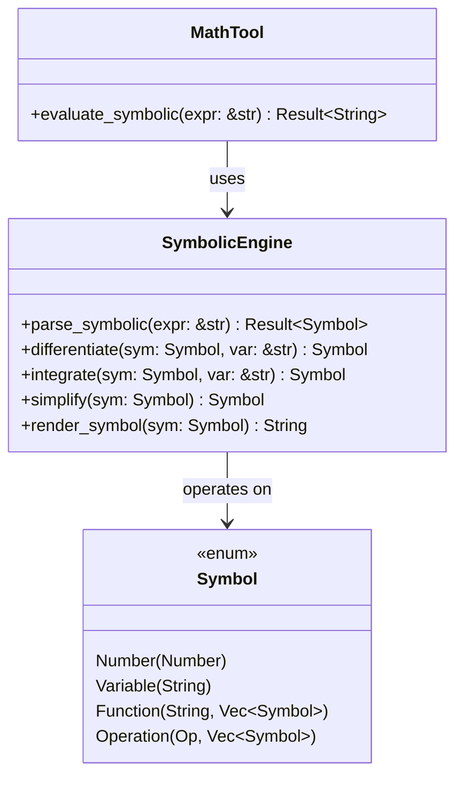

# Symbolic Mathematics

This document describes the symbolic mathematics capabilities in kistaverk's Math Tool, including differentiation, integration, and symbolic manipulation.

## 🧩 Symbolic Math Overview



## 🔤 Symbol Representation

### Symbol Enum

```rust
enum Symbol {
    /// Numeric constant
    Number(Number),
    
    /// Variable reference
    Variable(String),
    
    /// Function call
    Function(String, Vec<Symbol>),
    
    /// Mathematical operation
    Operation(Op, Vec<Symbol>),
}
```

### Supported Operations

```rust
enum Op {
    Add,      // a + b
    Sub,      // a - b
    Mul,      // a * b
    Div,      // a / b
    Pow,      // a ^ b
    Neg,      // -a
}
```

## 📝 Symbolic Expression Parsing

### Parsing Pipeline

```mermaid
flowchart TD
    A[User Input: "x^2 + sin(x)"] --> B[Tokenizer]
    B --> C[Symbolic Parser]
    C --> D[Symbol AST]
    D --> E[Differentiation/Integration]
    E --> F[Simplification]
    F --> G[Symbol Rendering]
    G --> H[Result: "2*x + cos(x)"]
```

### Tokenization

```rust
fn tokenize_symbolic(expr: &str) -> Result<Vec<SymbolToken>, String> {
    let mut tokens = Vec::new();
    let mut chars = expr.chars().peekable();
    
    while let Some(&c) = chars.peek() {
        match c {
            'a'..='z' | 'A'..='Z' => {
                // Parse variable or function name
                let mut ident = String::new();
                while let Some(&c) = chars.peek() {
                    if c.is_alphabetic() || c == '_' {
                        ident.push(chars.next().unwrap());
                    } else {
                        break;
                    }
                }
                
                // Check if it's a function call
                if let Some('(') = chars.peek() {
                    tokens.push(SymbolToken::Function(ident));
                    chars.next(); // consume '('
                } else {
                    tokens.push(SymbolToken::Variable(ident));
                }
            }
            '0'..='9' | '.' | '-' => {
                // Parse number (handled by numeric parser)
                let num_str = parse_number_string(&mut chars)?;
                tokens.push(SymbolToken::Number(num_str));
            }
            '+' | '-' | '*' | '/' | '^' => {
                // Parse operator
                let op = parse_operator(chars.next().unwrap());
                tokens.push(SymbolToken::Operator(op));
            }
            '(' | ')' | ',' => {
                // Parse grouping
                let token = match chars.next().unwrap() {
                    '(' => SymbolToken::LeftParen,
                    ')' => SymbolToken::RightParen,
                    ',' => SymbolToken::Comma,
                    _ => unreachable!(),
                };
                tokens.push(token);
            }
            _ => return Err(format!("Unexpected character: {}", c)),
        }
    }
    
    Ok(tokens)
}
```

### AST Construction

```rust
fn parse_symbolic_expression(tokens: &[SymbolToken]) -> Result<Symbol, String> {
    // Uses recursive descent parsing
    parse_additive(tokens)
}

fn parse_additive(tokens: &[SymbolToken]) -> Result<Symbol, String> {
    let mut left = parse_multiplicative(tokens)?;
    
    while let Some((op, remaining)) = consume_operator(tokens, &[Op::Add, Op::Sub]) {
        let right = parse_multiplicative(remaining)?;
        left = Symbol::Operation(op, vec![left, right]);
    }
    
    Ok(left)
}
```

## 📊 Differentiation

### Differentiation Rules

```rust
fn differentiate(symbol: &Symbol, var: &str) -> Symbol {
    match symbol {
        Symbol::Number(_) => Symbol::Number(Number::from_f64(0.0)),
        
        Symbol::Variable(v) => {
            if v == var {
                Symbol::Number(Number::from_f64(1.0))
            } else {
                Symbol::Number(Number::from_f64(0.0))
            }
        }
        
        Symbol::Function(name, args) => {
            match name.as_str() {
                "sin" => {
                    let [arg] = args.as_slice() else { 
                        return Symbol::Number(Number::from_f64(0.0)) 
                    };
                    let d_arg = differentiate(arg, var);
                    Symbol::Operation(Op::Mul, vec![
                        Symbol::Function("cos", vec![arg.clone()]),
                        d_arg
                    ])
                }
                "cos" => {
                    let [arg] = args.as_slice() else { 
                        return Symbol::Number(Number::from_f64(0.0)) 
                    };
                    let d_arg = differentiate(arg, var);
                    Symbol::Operation(Op::Mul, vec![
                        Symbol::Operation(Op::Neg, vec![
                            Symbol::Function("sin", vec![arg.clone()])
                        ]),
                        d_arg
                    ])
                }
                "exp" => {
                    let [arg] = args.as_slice() else { 
                        return Symbol::Number(Number::from_f64(0.0)) 
                    };
                    let d_arg = differentiate(arg, var);
                    Symbol::Operation(Op::Mul, vec![
                        Symbol::Function("exp", vec![arg.clone()]),
                        d_arg
                    ])
                }
                "log" => {
                    let [arg] = args.as_slice() else { 
                        return Symbol::Number(Number::from_f64(0.0)) 
                    };
                    let d_arg = differentiate(arg, var);
                    Symbol::Operation(Op::Div, vec![
                        d_arg,
                        arg.clone()
                    ])
                }
                _ => Symbol::Number(Number::from_f64(0.0)), // Unknown function
            }
        }
        
        Symbol::Operation(op, args) => {
            match op {
                Op::Add | Op::Sub => {
                    // Linear operations: d(a ± b) = da ± db
                    let mut result_args = Vec::new();
                    for arg in args {
                        result_args.push(differentiate(arg, var));
                    }
                    Symbol::Operation(op.clone(), result_args)
                }
                
                Op::Mul => {
                    // Product rule: d(a*b) = da*b + a*db
                    let [a, b] = args.as_slice() else { 
                        return Symbol::Number(Number::from_f64(0.0)) 
                    };
                    let da = differentiate(a, var);
                    let db = differentiate(b, var);
                    
                    Symbol::Operation(Op::Add, vec![
                        Symbol::Operation(Op::Mul, vec![da, b.clone()]),
                        Symbol::Operation(Op::Mul, vec![a.clone(), db]),
                    ])
                }
                
                Op::Div => {
                    // Quotient rule: d(a/b) = (da*b - a*db)/b^2
                    let [a, b] = args.as_slice() else { 
                        return Symbol::Number(Number::from_f64(0.0)) 
                    };
                    let da = differentiate(a, var);
                    let db = differentiate(b, var);
                    
                    let numerator = Symbol::Operation(Op::Sub, vec![
                        Symbol::Operation(Op::Mul, vec![da, b.clone()]),
                        Symbol::Operation(Op::Mul, vec![a.clone(), db]),
                    ]);
                    
                    let denominator = Symbol::Operation(Op::Pow, vec![
                        b.clone(),
                        Symbol::Number(Number::from_f64(2.0))
                    ]);
                    
                    Symbol::Operation(Op::Div, vec![numerator, denominator])
                }
                
                Op::Pow => {
                    // Power rule: d(a^b) = b*a^(b-1)*da (when b is constant)
                    // Chain rule: d(a^b) = a^b * ln(a) * db (when a is constant)
                    // General case: d(a^b) = a^b * (b*da/a + ln(a)*db)
                    let [a, b] = args.as_slice() else { 
                        return Symbol::Number(Number::from_f64(0.0)) 
                    };
                    
                    let da = differentiate(a, var);
                    let db = differentiate(b, var);
                    
                    // Check if exponent is constant
                    if let Symbol::Number(_) = b {
                        // Simple power rule
                        let b_minus_1 = Symbol::Operation(Op::Sub, vec![
                            b.clone(),
                            Symbol::Number(Number::from_f64(1.0))
                        ]);
                        let a_to_b_minus_1 = Symbol::Operation(Op::Pow, vec![
                            a.clone(),
                            b_minus_1
                        ]);
                        
                        Symbol::Operation(Op::Mul, vec![
                            b.clone(),
                            a_to_b_minus_1,
                            da,
                        ])
                    } else if let Symbol::Number(_) = a {
                        // Simple exponential rule
                        let a_to_b = Symbol::Operation(Op::Pow, vec![
                            a.clone(),
                            b.clone()
                        ]);
                        let ln_a = Symbol::Function("log", vec![a.clone()]);
                        
                        Symbol::Operation(Op::Mul, vec![
                            a_to_b,
                            ln_a,
                            db,
                        ])
                    } else {
                        // General case
                        let a_to_b = Symbol::Operation(Op::Pow, vec![
                            a.clone(),
                            b.clone()
                        ]);
                        let ln_a = Symbol::Function("log", vec![a.clone()]);
                        
                        let term1 = Symbol::Operation(Op::Mul, vec![
                            Symbol::Operation(Op::Div, vec![
                                b.clone(),
                                a.clone()
                            ]),
                            da
                        ]);
                        
                        let term2 = Symbol::Operation(Op::Mul, vec![
                            ln_a,
                            db
                        ]);
                        
                        let sum = Symbol::Operation(Op::Add, vec![term1, term2]);
                        
                        Symbol::Operation(Op::Mul, vec![a_to_b, sum])
                    }
                }
                
                Op::Neg => {
                    // d(-a) = -da
                    let [arg] = args.as_slice() else { 
                        return Symbol::Number(Number::from_f64(0.0)) 
                    };
                    let d_arg = differentiate(arg, var);
                    Symbol::Operation(Op::Neg, vec![d_arg])
                }
            }
        }
    }
}
```

### Differentiation Examples

| Input | Output | Rule |
|-------|--------|------|
| `x^2` | `2*x` | Power rule |
| `sin(x)` | `cos(x)` | Sine derivative |
| `exp(x^2)` | `2*x*exp(x^2)` | Chain rule |
| `x*sin(x)` | `sin(x) + x*cos(x)` | Product rule |
| `sin(x)/x` | `(x*cos(x) - sin(x))/x^2` | Quotient rule |

## ∫ Integration

### Integration Rules

```rust
fn integrate(symbol: &Symbol, var: &str) -> Symbol {
    match symbol {
        Symbol::Number(_) => {
            // ∫c dx = c*x
            Symbol::Operation(Op::Mul, vec![
                symbol.clone(),
                Symbol::Variable(var.to_string())
            ])
        }
        
        Symbol::Variable(v) => {
            if v == var {
                // ∫x dx = x^2/2
                Symbol::Operation(Op::Div, vec![
                    Symbol::Operation(Op::Pow, vec![
                        Symbol::Variable(var.to_string()),
                        Symbol::Number(Number::from_f64(2.0))
                    ]),
                    Symbol::Number(Number::from_f64(2.0))
                ])
            } else {
                // ∫y dx = y*x (y is constant wrt x)
                Symbol::Operation(Op::Mul, vec![
                    symbol.clone(),
                    Symbol::Variable(var.to_string())
                ])
            }
        }
        
        Symbol::Function(name, args) => {
            match name.as_str() {
                "sin" => {
                    let [arg] = args.as_slice() else { 
                        return Symbol::Operation(Op::Mul, vec![
                            symbol.clone(),
                            Symbol::Variable(var.to_string())
                        ]) 
                    };
                    // ∫sin(u) du = -cos(u) + C
                    Symbol::Operation(Op::Neg, vec![
                        Symbol::Function("cos", vec![arg.clone()])
                    ])
                }
                "cos" => {
                    let [arg] = args.as_slice() else { 
                        return Symbol::Operation(Op::Mul, vec![
                            symbol.clone(),
                            Symbol::Variable(var.to_string())
                        ]) 
                    };
                    // ∫cos(u) du = sin(u) + C
                    Symbol::Function("sin", vec![arg.clone()])
                }
                "exp" => {
                    let [arg] = args.as_slice() else { 
                        return Symbol::Operation(Op::Mul, vec![
                            symbol.clone(),
                            Symbol::Variable(var.to_string())
                        ]) 
                    };
                    // ∫exp(u) du = exp(u) + C
                    Symbol::Function("exp", vec![arg.clone()])
                }
                "log" => {
                    let [arg] = args.as_slice() else { 
                        return Symbol::Operation(Op::Mul, vec![
                            symbol.clone(),
                            Symbol::Variable(var.to_string())
                        ]) 
                    };
                    // ∫log(u) du = u*log(u) - u + C
                    Symbol::Operation(Op::Sub, vec![
                        Symbol::Operation(Op::Mul, vec![
                            arg.clone(),
                            Symbol::Function("log", vec![arg.clone()])
                        ]),
                        arg.clone()
                    ])
                }
                _ => Symbol::Operation(Op::Mul, vec![
                    symbol.clone(),
                    Symbol::Variable(var.to_string())
                ]),
            }
        }
        
        Symbol::Operation(op, args) => {
            match op {
                Op::Add | Op::Sub => {
                    // Linear operations: ∫(a ± b) = ∫a ± ∫b
                    let mut result_args = Vec::new();
                    for arg in args {
                        result_args.push(integrate(arg, var));
                    }
                    Symbol::Operation(op.clone(), result_args)
                }
                
                Op::Mul => {
                    // ∫a*b dx - handled by pattern matching specific cases
                    // For now, return a*b*x as fallback
                    Symbol::Operation(Op::Mul, vec![
                        symbol.clone(),
                        Symbol::Variable(var.to_string())
                    ])
                }
                
                Op::Div => {
                    // ∫a/b dx - handled by pattern matching specific cases
                    // For now, return (a/b)*x as fallback
                    Symbol::Operation(Op::Mul, vec![
                        symbol.clone(),
                        Symbol::Variable(var.to_string())
                    ])
                }
                
                Op::Pow => {
                    let [a, b] = args.as_slice() else { 
                        return Symbol::Operation(Op::Mul, vec![
                            symbol.clone(),
                            Symbol::Variable(var.to_string())
                        ]) 
                    };
                    
                    // ∫x^n dx = x^(n+1)/(n+1) for n ≠ -1
                    if let Symbol::Variable(v) = a {
                        if v == var {
                            if let Symbol::Number(n) = b {
                                let n_val = n.to_f64();
                                if n_val != -1.0 {
                                    let new_exp = Symbol::Number(Number::from_f64(n_val + 1.0));
                                    let denominator = Symbol::Number(Number::from_f64(n_val + 1.0));
                                    
                                    return Symbol::Operation(Op::Div, vec![
                                        Symbol::Operation(Op::Pow, vec![
                                            a.clone(),
                                            new_exp
                                        ]),
                                        denominator
                                    ]);
                                }
                            }
                        }
                    }
                    
                    // Fallback for other cases
                    Symbol::Operation(Op::Mul, vec![
                        symbol.clone(),
                        Symbol::Variable(var.to_string())
                    ])
                }
                
                Op::Neg => {
                    // ∫-a dx = -∫a dx
                    let [arg] = args.as_slice() else { 
                        return Symbol::Operation(Op::Mul, vec![
                            symbol.clone(),
                            Symbol::Variable(var.to_string())
                        ]) 
                    };
                    Symbol::Operation(Op::Neg, vec![integrate(arg, var)])
                }
            }
        }
    }
}
```

### Integration Examples

| Input | Output | Rule |
|-------|--------|------|
| `2*x` | `x^2` | Power rule |
| `cos(x)` | `sin(x)` | Cosine integral |
| `1/x` | `log(x)` | Reciprocal rule |
| `x^2 + sin(x)` | `x^3/3 - cos(x)` | Linearity |

## 🎨 Symbol Rendering

### Rendering to String

```rust
fn render_symbol(symbol: &Symbol) -> String {
    match symbol {
        Symbol::Number(n) => {
            if let Ok(int_val) = n.to_f64().try_into() {
                int_val.to_string()
            } else {
                format!("{:.6}", n.to_f64())
            }
        }
        Symbol::Variable(v) => v.clone(),
        Symbol::Function(name, args) => {
            if args.is_empty() {
                name.clone()
            } else {
                format!("{}({})", name, 
                    args.iter()
                       .map(|arg| render_symbol(arg))
                       .collect::<Vec<_>>()
                       .join(", "))
            }
        }
        Symbol::Operation(op, args) => {
            match op {
                Op::Add => {
                    format!("({})", 
                        args.iter()
                           .map(|arg| render_symbol(arg))
                           .collect::<Vec<_>>()
                           .join(" + "))
                }
                Op::Sub => {
                    if args.len() == 1 {
                        format!("-{}", render_symbol(&args[0]))
                    } else {
                        format!("({}) - {}", 
                            render_symbol(&args[0]),
                            args[1..].iter()
                                .map(|arg| render_symbol(arg))
                                .collect::<Vec<_>>()
                                .join(" - "))
                    }
                }
                Op::Mul => {
                    // Handle implicit multiplication
                    let rendered_args: Vec<String> = args.iter()
                        .map(|arg| {
                            let rendered = render_symbol(arg);
                            // Add parentheses if the argument is an operation
                            if let Symbol::Operation(_, _) = arg {
                                format!("({})", rendered)
                            } else {
                                rendered
                            }
                        })
                        .collect();
                    
                    rendered_args.join("*")
                }
                Op::Div => {
                    format!("({})/({})", 
                        render_symbol(&args[0]),
                        render_symbol(&args[1]))
                }
                Op::Pow => {
                    let base = render_symbol(&args[0]);
                    let exp = render_symbol(&args[1]);
                    
                    // Add parentheses for complex exponents
                    if let Symbol::Operation(_, _) = &args[1] {
                        format!("{}^({})", base, exp)
                    } else {
                        format!("{}^", base) + &exp
                    }
                }
                Op::Neg => {
                    format!("-{}", render_symbol(&args[0]))
                }
            }
        }
    }
}
```

### Rendering Examples

| Symbol | Rendered |
|--------|----------|
| `Operation(Add, [Number(2), Number(3)])` | `(2 + 3)` |
| `Operation(Mul, [Variable("x"), Number(2)])` | `x*2` |
| `Function("sin", [Operation(Add, [Variable("x"), Number(1)])])` | `sin(x + 1)` |
| `Operation(Pow, [Variable("x"), Number(2)])` | `x^2` |

## 🔄 Symbolic Simplification

### Simplification Rules

```rust
fn simplify(symbol: Symbol) -> Symbol {
    match symbol {
        Symbol::Operation(op, args) => {
            let simplified_args: Vec<Symbol> = args.into_iter()
                .map(simplify)
                .collect();
            
            // Apply simplification rules
            match op {
                Op::Add => simplify_addition(simplified_args),
                Op::Sub => simplify_subtraction(simplified_args),
                Op::Mul => simplify_multiplication(simplified_args),
                Op::Div => simplify_division(simplified_args),
                Op::Pow => simplify_exponentiation(simplified_args),
                Op::Neg => simplify_negation(simplified_args),
            }
        }
        Symbol::Function(name, args) => {
            let simplified_args: Vec<Symbol> = args.into_iter()
                .map(simplify)
                .collect();
            Symbol::Function(name, simplified_args)
        }
        _ => symbol,
    }
}

fn simplify_addition(args: Vec<Symbol>) -> Symbol {
    // Flatten nested additions
    let mut terms = Vec::new();
    let mut constant = Number::from_f64(0.0);
    
    for arg in args {
        match arg {
            Symbol::Operation(Op::Add, nested_args) => {
                // Recursively flatten
                let flattened = simplify_addition(nested_args);
                if let Symbol::Operation(Op::Add, flat_args) = flattened {
                    terms.extend(flat_args);
                } else {
                    terms.push(flattened);
                }
            }
            Symbol::Number(n) => {
                // Combine constants
                constant = constant + n;
            }
            _ => terms.push(arg),
        }
    }
    
    // Sort terms (variables first, then constants)
    terms.sort_by(|a, b| {
        match (a, b) {
            (Symbol::Variable(_), Symbol::Number(_)) => Ordering::Less,
            (Symbol::Number(_), Symbol::Variable(_)) => Ordering::Greater,
            _ => Ordering::Equal,
        }
    });
    
    // Add constant term if non-zero
    if constant.to_f64() != 0.0 {
        terms.push(Symbol::Number(constant));
    }
    
    // Return simplified expression
    if terms.len() == 1 {
        terms.into_iter().next().unwrap()
    } else {
        Symbol::Operation(Op::Add, terms)
    }
}
```

### Simplification Examples

| Input | Simplified |
|-------|------------|
| `x + 0` | `x` |
| `2 + 3` | `5` |
| `x + x` | `2*x` |
| `(x + 2) + 3` | `x + 5` |
| `x*1` | `x` |
| `x*0` | `0` |

## 🚀 Future Enhancements

### Short-term Goals

1. **More Function Support**: Add support for more mathematical functions
2. **Better Simplification**: More advanced simplification rules
3. **Pattern Matching**: Improved integration patterns

### Medium-term Goals

1. **Symbolic Equation Solving**: Solve equations symbolically
2. **Matrix Operations**: Symbolic linear algebra
3. **Series Expansion**: Taylor and Maclaurin series

### Long-term Goals

1. **Full CAS System**: Complete computer algebra system
2. **MIR Integration**: Use MIR for symbolic optimization
3. **Automatic Differentiation**: AD using symbolic methods

## 📁 File Structure

```
rust/src/features/
├── math_tool.rs       # Symbolic math implementation
└── math_tool_test.rs  # Symbolic math tests
```

## 📚 Related Documents

- **[Math Tool Overview](overview.md)** - Math tool features and usage
- **[Precision Implementation](precision.md)** - Precision system details
- **[System Architecture](../../architecture/overview.md)** - Overall system architecture
- **[CAS Design](../../architecture/cas-design.md)** - CAS architecture details

**Last updated:** 2025-12-14