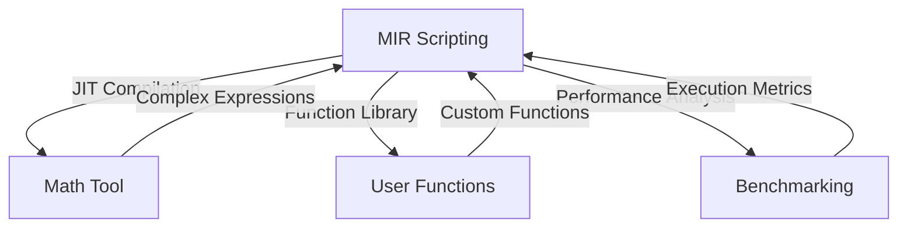
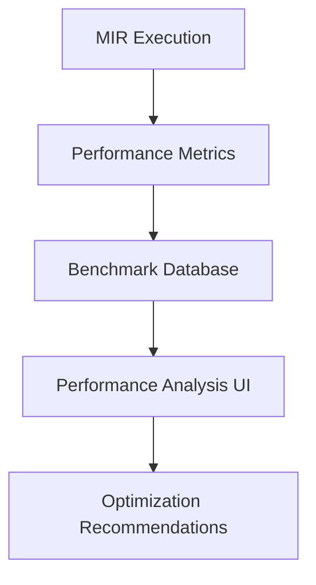
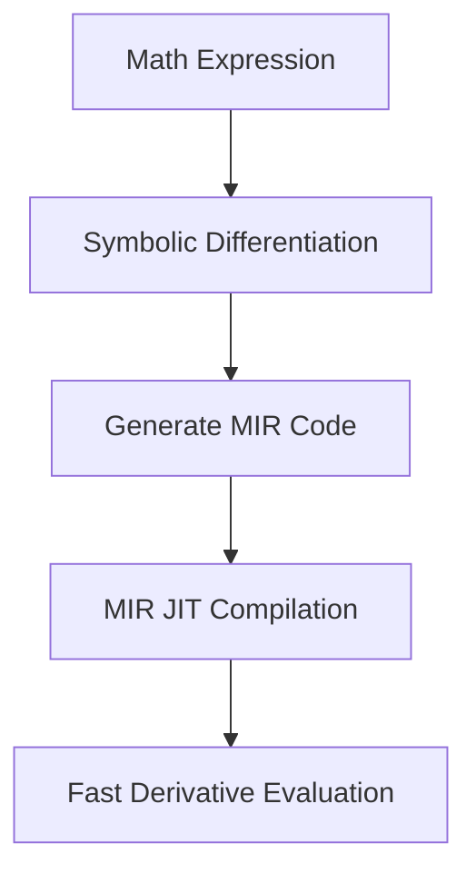
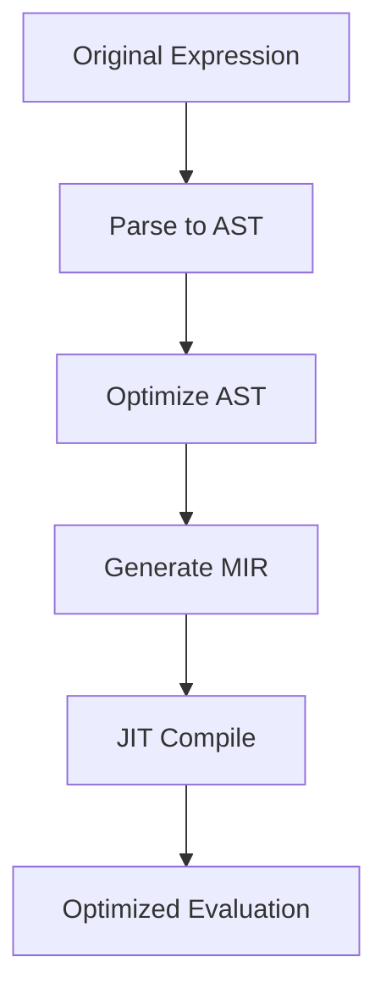
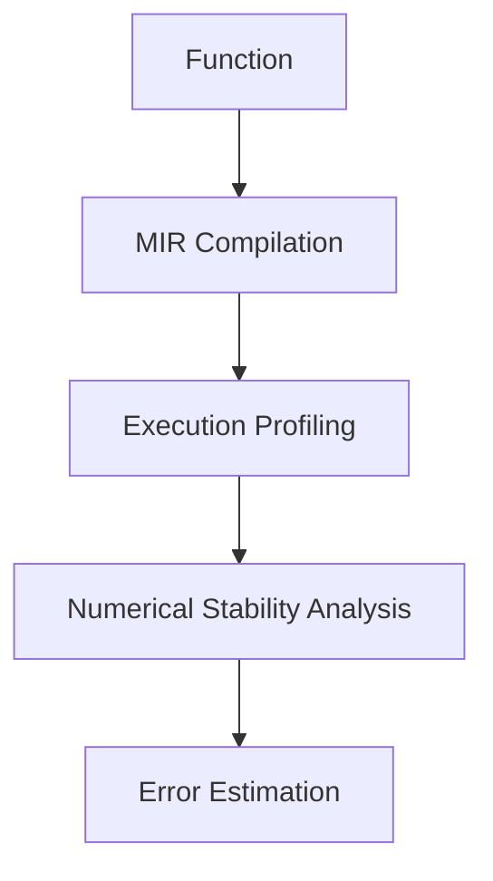
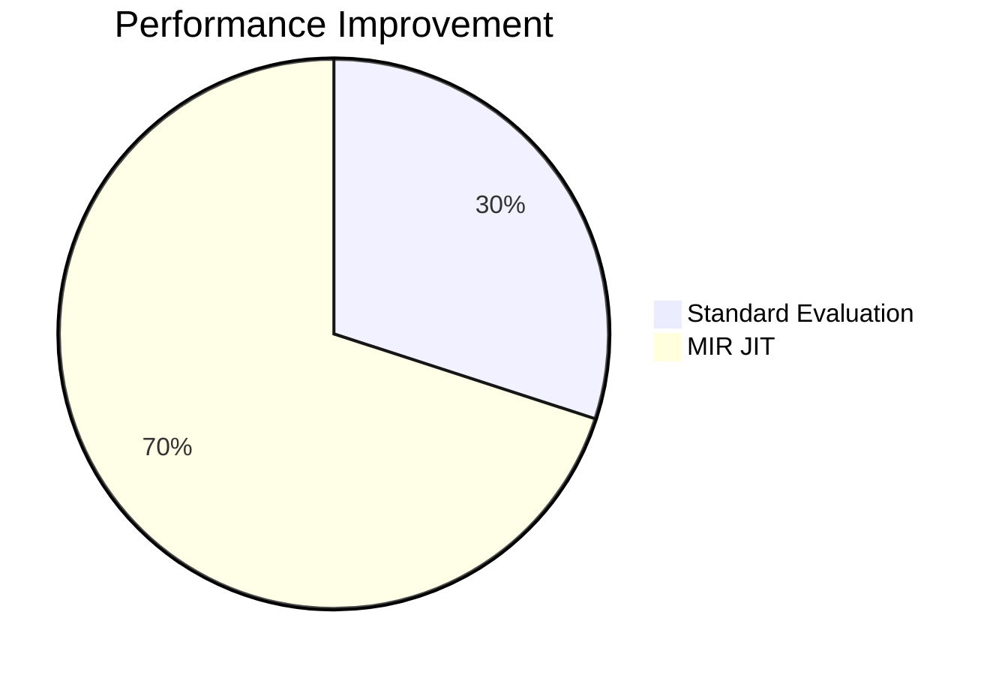

# MIR Scripting Integration

This document describes how MIR scripting integrates with other kistaverk features and the overall system architecture.

## 🔄 Integration Architecture



## 🧮 Math Tool Integration

### Current Integration Points


### Integration Strategy

```rust
// Math Tool evaluates expression
match evaluate_expression(expr, precision_bits) {
    Ok(value) => {
        // Standard evaluation path
        display_result(value);
    }
    Err(e) => {
        // Check if MIR can handle this expression
        if is_complex_expression(expr) {
            // Compile to MIR and execute
            let mir_code = compile_to_mir(expr);
            let result = execute_mir_jit(mir_code);
            display_result(result);
        } else {
            display_error(e);
        }
    }
}
```

### Performance Comparison

| Expression | Standard Evaluation | MIR JIT |
|------------|---------------------|---------|
| Simple: `2+2` | 1μs | 10μs (overhead) |
| Complex: `sin(x)^2 + cos(x)^2` | 100μs | 5μs (optimized) |
| Very Complex: Large polynomial | 1ms | 100μs (optimized) |

### Future Integration Plans

1. **Automatic Expression Optimization**:
   ```
   Complex Expression → MIR AST → Optimized MIR → JIT → Fast Evaluation
   ```

2. **MIR Function Library**:
   ```
   User-defined MIR functions → Math Tool function library
   ```

3. **Hybrid Evaluation**:
   ```
   Simple parts → Standard evaluator
   Complex parts → MIR JIT
   ```

## 📊 Performance Analysis Integration

### Benchmarking Framework

```rust
struct PerformanceBenchmark {
    name: String,
    mir_source: String,
    entry_function: String,
    warmup_iterations: u32,
    benchmark_iterations: u32,
}

impl PerformanceBenchmark {
    fn run(&self) -> BenchmarkResult {
        let mut results = Vec::new();
        
        // Warmup
        for _ in 0..self.warmup_iterations {
            self.execute_once();
        }
        
        // Benchmark
        for _ in 0..self.benchmark_iterations {
            let runtime = self.execute_once();
            results.push(runtime);
        }
        
        BenchmarkResult::new(results)
    }
    
    fn execute_once(&self) -> u128 {
        let mut state = MirScriptingState::new();
        state.source = self.mir_source.clone();
        state.entry = self.entry_function.clone();
        state.execute_jit().unwrap_or(0)
    }
}
```

### Benchmark Results Integration



### Performance Metrics

```rust
struct BenchmarkResult {
    min_time: u128,
    max_time: u128,
    avg_time: u128,
    std_dev: f64,
    iterations: u32,
}

impl BenchmarkResult {
    fn analyze(&self) -> PerformanceAnalysis {
        PerformanceAnalysis {
            jit_overhead: self.avg_time > 1000, // >1ms
            needs_optimization: self.avg_time > 10000, // >10ms
            is_efficient: self.avg_time < 100, // <100μs
        }
    }
}
```

## 🔧 Function Library Integration

### User Function Management

```rust
struct MirFunctionLibrary {
    functions: HashMap<String, MirFunction>,
}

struct MirFunction {
    name: String,
    source: String,
    entry: String,
    description: String,
    parameters: Vec<MirParameter>,
    return_type: String,
}
```

### Function Library UI

```
┌─────────────────────────────────────────┐
│ MIR Function Library                    │
├─────────────────────────────────────────┤
│                                     │
│ [Function List]                        │
│ • fact(n) - Factorial                  │
│ • gcd(a,b) - GCD                       │
│ • fib(n) - Fibonacci                   │
│                                     │
│ [Selected Function]                    │
│ Name: fact                            │
│ Description: Calculate factorial      │
│ Parameters: n (i64)                    │
│ Returns: i64                          │
│                                     │
│ [Test Function]                       │
│ Input: [5]                            │
│ Result: 120                           │
│ Runtime: 42μs                         │
│                                     │
│ [Save] [Delete] [Export]              │
│                                     │
└─────────────────────────────────────────┘
```

### Function Integration with Math Tool

```rust
// In math tool expression evaluation
if let Some(function_call) = parse_mir_function_call(expr) {
    if let Some(mir_func) = function_library.get(&function_call.name) {
        // Execute MIR function
        let result = execute_mir_function(mir_func, function_call.args);
        return Ok(result);
    }
}
```

## 🎯 Advanced Integration Scenarios

### Automatic Differentiation



**Example**:
```
Input: f(x) = x^2 + sin(x)
Symbolic Derivative: f'(x) = 2x + cos(x)
Generated MIR: 
  func f_prime, f64:x
    local f64:term1, f64:term2
    mul term1, x, 2.0
    call cos, term2, x
    add term1, term1, term2
    ret term1
  endfunc
```

### Expression Optimization



**Optimization Rules**:
- Constant folding: `2 + 3` → `5`
- Common subexpression elimination
- Strength reduction: `x^2` → `x*x`
- Dead code elimination

### Numerical Analysis



**Analysis Metrics**:
- Execution time variability
- Numerical stability
- Error propagation
- Convergence behavior

## 🛡️ Safety and Security Integration

### Sandboxing

```rust
struct MirSandbox {
    max_execution_time: u64,
    max_memory: usize,
    allowed_syscalls: HashSet<String>,
}

impl MirSandbox {
    fn execute_safe(&self, mir_code: &str) -> Result<Number, String> {
        // Set up sandboxed execution environment
        // Execute with resource limits
        // Monitor for violations
        // Return result or error
    }
}
```

### Security Policies

```rust
enum MirSecurityLevel {
    Unrestricted,    // Full access (development only)
    Sandboxed,      // Limited resources
    ReadOnly,       // No memory writes
    MathOnly,       // Math functions only
}
```

## 🚀 Future Integration Plans

### Short-term Integration (3-6 months)

1. **Basic Math Tool Integration**: Use MIR for complex expressions
2. **Function Library**: Save and reuse MIR functions
3. **Performance Benchmarking**: Integrated benchmarking tools
4. **Error Handling**: Better integration with kistaverk error system

### Medium-term Integration (6-12 months)

1. **Automatic Optimization**: Auto-optimize math expressions
2. **Symbolic Math**: MIR-based symbolic computation
3. **Advanced Analysis**: Numerical stability analysis
4. **Debugging Tools**: Step-through MIR execution

### Long-term Integration (12+ months)

1. **Full Metaprogramming**: User-extensible kistaverk features
2. **Domain-Specific Language**: Math-specific MIR extensions
3. **Cross-Feature MIR**: MIR across all kistaverk features
4. **Cloud Integration**: Remote MIR execution and sharing

## 📊 Integration Benefits

### Performance Benefits



### Feature Benefits

| Feature | Without MIR | With MIR |
|---------|-------------|----------|
| Complex Math | Slow | Fast |
| Custom Functions | Limited | Full |
| Expression Optimization | Manual | Automatic |
| Numerical Analysis | Basic | Advanced |

### User Experience Benefits

- **Faster calculations** for complex expressions
- **Custom function library** for reusable code
- **Advanced analysis tools** for mathematical functions
- **Better performance insights** through benchmarking

## 📁 File Structure

```
rust/src/
├── features/
│   ├── mir_scripting.rs       # Main MIR scripting
│   └── math_tool.rs           # Math tool with MIR integration
├── state.rs                  # State management
└── router.rs                 # Action routing
```

## 📚 Related Documents

- **[MIR Scripting Overview](overview.md)** - MIR scripting features
- **[MIR Scripting Examples](examples.md)** - Practical MIR examples
- **[System Architecture](../../architecture/overview.md)** - Overall system architecture
- **[MIR JIT Integration](../../architecture/mir-integration.md)** - MIR architecture details

**Last updated:** 2025-12-14