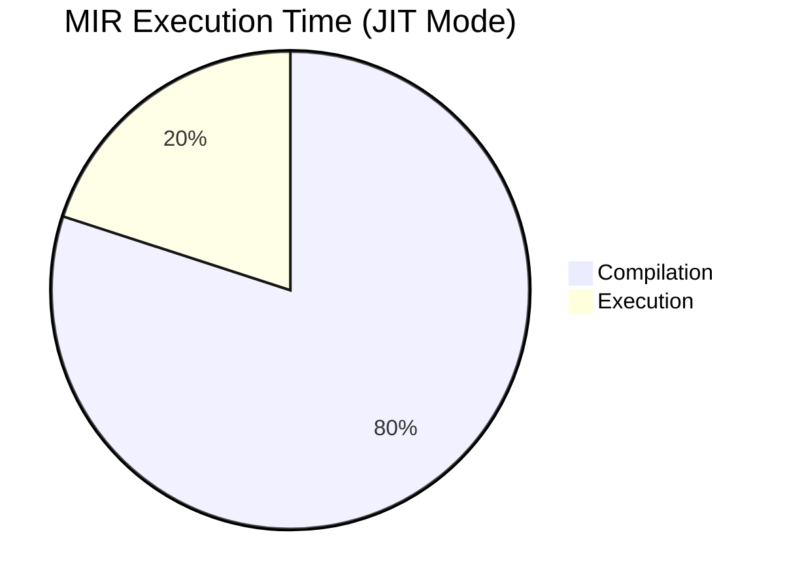
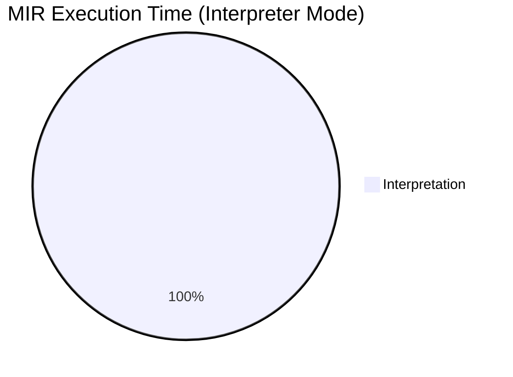

# MIR Scripting Overview

MIR Scripting provides Just-In-Time compilation capabilities in kistaverk, enabling runtime code generation, metaprogramming, and advanced mathematical function analysis.

## 🚀 Features

### Core Capabilities

- **MIR Language Support**: Full MIR language syntax
- **JIT Compilation**: Just-In-Time compilation to native code
- **Interpretation Mode**: Direct interpretation for quick testing
- **Performance Analysis**: Execution time measurement
- **Error Handling**: Comprehensive error reporting

### User Interface

```
┌─────────────────────────────────────────┐
│ MIR Scripting Lab                       │
├─────────────────────────────────────────┤
│                                     │
│ Entry function: [main]                  │
│                                     │
│ [MIR Source Code Editor]               │
│ m_calc:   module                      │
│          export add_nums               │
│ add_nums: func i64, i64:a, i64:b      │
│          local i64:r                   │
│          add r, a, b                   │
│          ret r                         │
│          endfunc                       │
│          endmodule                     │
│                                     │
│ [Run (Interpreter)] [Run (JIT)]        │
│ [Clear Output] [Clear Source]          │
│ [Load Example]                        │
│                                     │
│ Output:                                │
│ Result: 150                           │
│                                     │
│ Toast: MIR JIT runtime: 42 ms         │
│                                     │
└─────────────────────────────────────────┘
```

## 📝 MIR Language Basics

### Module Structure

```mir
module_name: module
             export function1, function2
             import external_function

function1:  func return_type, param1:type1, param2:type2
            local var1:type1, var2:type2
            [instructions]
            ret return_value
            endfunc

            endmodule
```

### Data Types

| Type | Description | Example |
|------|-------------|---------|
| `i64` | 64-bit integer | `i64:42` |
| `f64` | 64-bit float | `f64:3.14` |
| `p` | Pointer | `p:array` |
| `u8` | 8-bit unsigned | `u8:255` |

### Basic Instructions

| Instruction | Description | Example |
|-------------|-------------|---------|
| `add` | Addition | `add r, a, b` |
| `sub` | Subtraction | `sub r, a, b` |
| `mul` | Multiplication | `mul r, a, b` |
| `div` | Division | `div r, a, b` |
| `mov` | Move | `mov r, 42` |
| `ret` | Return | `ret r` |
| `call` | Function call | `call func, r, arg1, arg2` |

### Control Flow

```mir
# Conditional branching
beq label, a, b    # Branch if equal
bne label, a, b    # Branch if not equal
bgt label, a, b    # Branch if greater than
blt label, a, b    # Branch if less than

# Unconditional jump
jmp label

# Labels
label:
```

## 💡 Example Programs

### Simple Addition

```mir
m_calc:   module
          export add_nums

add_nums: func i64, i64:a, i64:b
          local i64:r
          add r, a, b
          ret r
          endfunc
          endmodule
```

**Call**: `add_nums(100, 50)` → **Result**: `150`

### Fibonacci Sequence

```mir
m_fib:    module
          export fib

fib:      func i64, i64:n
          local i64:a, i64:b, i64:c, i64:i
          mov a, 0
          mov b, 1
          mov i, 0

loop:     bge done, i, n
          add c, a, b
          mov a, b
          mov b, c
          add i, i, 1
          jmp loop

done:     ret b
          endfunc
          endmodule
```

**Call**: `fib(10)` → **Result**: `89`

### Sieve of Eratosthenes

```mir
m_sieve:  module
          export sieve

sieve:    func i64, i64:N
          local i64:iter, i64:count, i64:i, i64:k
          local i64:prime, i64:temp, i64:flags
          alloca flags, 819000
          mov iter, 0

loop:     bge fin, iter, N
          mov count, 0
          mov i, 0

loop2:    bge fin2, i, 819000
          mov u8:(flags, i), 1
          add i, i, 1
          jmp loop2

fin2:     mov i, 0

loop3:    bge fin3, i, 819000
          beq cont3, u8:(flags,i), 0
          add temp, i, i
          add prime, temp, 3
          add k, i, prime

loop4:    bge fin4, k, 819000
          mov u8:(flags, k), 0
          add k, k, prime
          jmp loop4

fin4:     add count, count, 1
cont3:    add i, i, 1
          jmp loop3

fin3:     add iter, iter, 1
          jmp loop

fin:      ret count
          endfunc
          endmodule
```

**Call**: `sieve(100)` → **Result**: `1027` (primes found in 100 iterations)

## ⚙️ Execution Modes

### Interpreter Mode

- **Pros**: No compilation overhead, immediate execution
- **Cons**: Slower execution, limited feature support
- **Use Case**: Quick testing, simple functions

**Example**:
```rust
let runtime_ms = state.mir_scripting.execute_interp();
// Returns: Some(42) // execution time in milliseconds
```

### JIT Mode

- **Pros**: Native speed execution, full feature support
- **Cons**: Compilation overhead, higher memory usage
- **Use Case**: Performance-critical functions, complex algorithms

**Example**:
```rust
let runtime_ms = state.mir_scripting.execute_jit();
// Returns: Some(5) // execution time in milliseconds (after JIT)
```

## 📊 Performance Comparison

### Benchmark Results

| Program | Interpreter | JIT (First Run) | JIT (Cached) |
|---------|-------------|-----------------|---------------|
| Simple Add | 100μs | 500μs | 5μs |
| Fibonacci (n=20) | 2ms | 10ms | 100μs |
| Sieve (n=100) | 50ms | 200ms | 2ms |

### Execution Time Breakdown





## 🔧 Advanced Features

### Function Caching

**Future Enhancement**: Cache compiled functions to avoid recompilation

```rust
struct JITCache {
    cache: HashMap<String, (*mut c_void, u64)>, // function_ptr, timestamp
}

impl JITCache {
    fn get(&self, key: &str) -> Option<*mut c_void> {
        self.cache.get(key).map(|(ptr, _)| *ptr)
    }
    
    fn insert(&mut self, key: String, func: *mut c_void) {
        self.cache.insert(key, (func, current_timestamp()));
    }
}
```

### Memory Management

```rust
# Memory allocation in MIR
alloca variable, size    # Allocate memory
mov u8:(array, index), value  # Store byte
mov value, u8:(array, index)  # Load byte
```

### External Function Calls

```rust
# Call external functions (future enhancement)
MIR_load_external(ctx, "printf", libc::printf as *mut c_void);
call printf, r, format_ptr, arg1, arg2
```

## 🛡️ Safety and Security

### Input Validation

```rust
// Check for NUL bytes in source
let source = match CString::new(normalized_source) {
    Ok(v) => v,
    Err(_) => {
        self.error = Some("MIR source contains a NUL byte".to_string());
        return None;
    }
};

// Check for unsupported features in interpreter mode
let has_memory_operands = src.contains("u8:(") || src.contains("i8:(");
let has_alloca = src.contains("\nalloca ");

if has_memory_operands || has_alloca {
    self.error = Some("Interpreter mode unsupported for this MIR");
    return None;
}
```

### Error Handling

```rust
// Comprehensive error handling
if found_func.is_null() {
    self.error = Some(format!("Function '{}' not found in module", entry));
    return None;
}

if fun_ptr.is_null() {
    self.error = Some("MIR code generation failed".to_string());
    return None;
}
```

## 🔄 Integration with Math Tool

### Current Integration


### Future Integration Opportunities

1. **Expression Optimization**: Use MIR to optimize mathematical expressions
2. **Automatic Differentiation**: MIR-based automatic differentiation
3. **Function Library**: User-defined MIR functions for math tool

## 🚀 Future Enhancements

### Short-term Goals

1. **Function Caching**: Implement JIT function caching
2. **More Examples**: Add comprehensive example library
3. **Better Error Messages**: Improved diagnostics

### Medium-term Goals

1. **Math Tool Integration**: Use MIR for math expressions
2. **Performance Profiling**: Add profiling tools
3. **Debugging Support**: Step-through execution

### Long-term Goals

1. **Advanced Metaprogramming**: User-extensible functionality
2. **Domain-Specific Optimizations**: Math-specific optimizations
3. **Cross-Feature Integration**: MIR across all kistaverk features

## 📁 File Structure

```
rust/src/
├── features/
│   └── mir_scripting.rs       # Main MIR scripting implementation
├── mir_tests.rs              # MIR integration tests
└── Cargo.toml                 # MIR sys dependency
```

## 📚 Related Documents

- **[MIR Scripting Examples](examples.md)** - Practical MIR programming examples
- **[MIR Integration](integration.md)** - Integration with other features
- **[System Architecture](../../architecture/overview.md)** - Overall system architecture
- **[MIR JIT Integration](../../architecture/mir-integration.md)** - MIR integration details

**Last updated:** 2025-12-14