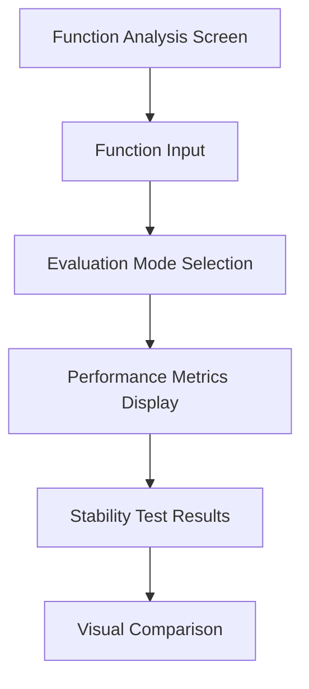

# MIR Advanced Features Implementation Plan

This document outlines the detailed implementation plan for three key MIR JIT integration features:

1. **Function Analysis Screen**: Performance comparison and stability testing
2. **Automatic Differentiation**: Using MIR code generation
3. **Advanced Visualization**: Plot function behavior

## 📋 Current State Analysis

### Existing MIR Math Integration

The current implementation (commit 42e0c31) provides:

- **MirMathLibrary**: Core library for managing MIR functions
- **Basic operations**: add, sub, mul, div implemented in MIR
- **Hybrid evaluation**: Fallback to MIR for complex expressions
- **Lazy compilation**: Functions compiled on first use
- **Expression complexity analysis**: Simple heuristic-based detection

### Current Limitations

1. **No performance comparison UI**: Users can't see MIR vs standard performance
2. **No automatic differentiation**: Manual derivative calculation only
3. **Limited visualization**: Basic text output only
4. **No stability testing**: No error handling or edge case analysis
5. **Basic function library**: Only arithmetic operations

## 🎯 Roadmap Implementation Plan

### 1. Function Analysis Screen: Performance Comparison and Stability Testing

#### 🎯 Objectives
- Create UI screen for comparing MIR vs standard evaluation performance
- Implement stability testing for edge cases
- Provide detailed performance metrics
- Enable function profiling

#### 📝 Implementation Steps

**Step 1: UI Design (2-3 days)**


**UI Components:**
- Function input field with syntax highlighting
- Evaluation mode toggle (Standard/MIR/Hybrid)
- Performance metrics panel (execution time, memory usage)
- Stability test results (edge cases, error handling)
- Visual comparison charts

**Step 2: Performance Measurement System (3-4 days)**
```rust
struct PerformanceMetrics {
    execution_time_ms: f64,
    memory_usage_kb: u32,
    compilation_time_ms: Option<f64>,  // For MIR JIT
    cache_hits: u32,
    error_rate: f64,
}

impl MathToolState {
    fn benchmark_function(&mut self, expr: &str, iterations: u32) -> PerformanceMetrics {
        // Measure standard evaluation
        let standard_time = self.benchmark_standard(expr, iterations);
        
        // Measure MIR evaluation
        let mir_time = self.benchmark_mir(expr, iterations);
        
        // Compare and return metrics
        PerformanceMetrics {
            standard_time,
            mir_time,
            speedup: standard_time / mir_time,
            // ... other metrics
        }
    }
}
```

**Step 3: Stability Testing Framework (2-3 days)**
```rust
struct StabilityTestResult {
    test_name: String,
    passed: bool,
    error_message: Option<String>,
    execution_time_ms: f64,
}

impl MirMathLibrary {
    fn run_stability_tests(&mut self) -> Vec<StabilityTestResult> {
        let mut results = Vec::new();
        
        // Test edge cases
        results.push(self.test_edge_case("division by zero", "1/0"));
        results.push(self.test_edge_case("overflow", "1e308 * 1e308"));
        results.push(self.test_edge_case("underflow", "1e-308 / 1e308"));
        results.push(self.test_edge_case("NaN handling", "sqrt(-1)"));
        
        // Test complex expressions
        results.push(self.test_complex_expression("nested functions", "sin(cos(tan(exp(log(42)))))"));
        
        results
    }
}
```

**Step 4: Integration with Math Tool (1-2 days)**
- Add "Function Analysis" button to math tool UI
- Create navigation to new screen
- Implement state management for analysis results
- Add export functionality for test reports

**Step 5: Documentation (1 day)**
- User guide for function analysis
- Performance tuning recommendations
- Stability test interpretation guide

#### ✅ Success Criteria
- ✅ Users can compare MIR vs standard performance
- ✅ Stability tests run automatically for complex functions
- ✅ Performance metrics displayed in real-time
- ✅ Visual comparison charts available
- ✅ Export functionality for analysis reports

### 2. Automatic Differentiation: Using MIR Code Generation

#### 🎯 Objectives
- Implement automatic differentiation using MIR
- Support forward and reverse mode AD
- Integrate with existing math tool
- Provide gradient computation for optimization

#### 📝 Implementation Steps

**Step 1: AD Theory Research (1 day)**
- Study forward vs reverse mode automatic differentiation
- Research MIR-based AD implementations
- Design data structures for AD computation

**Step 2: MIR AD Code Generator (4-5 days)**
```rust
struct AutomaticDifferentiator {
    mir_library: MirMathLibrary,
    ad_mode: ADMode,  // Forward or Reverse
}

enum ADMode {
    Forward,
    Reverse,
}

impl AutomaticDifferentiator {
    fn differentiate(&mut self, expr: &str, var: &str) -> Result<String, String> {
        // Parse expression to AST
        let ast = self.parse_expression(expr)?;
        
        // Generate MIR code for original function
        let original_mir = self.generate_mir(&ast)?;
        
        // Apply AD transformation to MIR
        let ad_mir = self.apply_ad_transform(&original_mir, var)?;
        
        // Register and compile AD function
        self.mir_library.register(
            format!("ad_{}", var),
            ad_mir
        );
        
        Ok(format!("ad_{}", var))
    }
    
    fn apply_ad_transform(&self, mir_code: &str, var: &str) -> Result<String, String> {
        // Transform MIR code to compute derivatives
        // For forward mode: augment with derivative computation
        // For reverse mode: build computation graph
        
        // Example transformation for f(x) = x^2
        // Original: mul r, x, x
        // AD: mul r, x, x; mul dr, x, 2 (forward mode)
        
        Ok(transformed_code)
    }
}
```

**Step 3: AD MIR Function Library (2-3 days)**
```rust
impl MirMathLibrary {
    fn register_ad_functions(&mut self) {
        // Basic AD functions
        self.register("ad_pow".to_string(), r#"
            m_ad_pow: module
              export ad_pow
            ad_pow: func i64, i64:x, i64:n
              local i64:r, i64:dr
              // Compute f(x) = x^n
              // Compute df/dx = n*x^(n-1)
              // ... MIR implementation
              ret r
              endfunc
              endmodule
        "#.to_string());
        
        // Add more AD functions: ad_sin, ad_cos, ad_exp, etc.
    }
}
```

**Step 4: Math Tool Integration (2-3 days)**
```rust
impl MathToolState {
    fn compute_derivative(&mut self, expr: &str, var: &str) -> Result<Number, String> {
        // Use MIR-based automatic differentiation
        let mut differentiator = AutomaticDifferentiator::new();
        let ad_function = differentiator.differentiate(expr, var)?;
        
        // Execute AD function
        let result = self.mir_math_library.execute(&ad_function, vec![Number::from_f64(1.0)]);
        
        result
    }
}
```

**Step 5: UI Integration (1-2 days)**
- Add "Compute Derivative" button to math tool
- Support derivative syntax: `deriv(f(x), x)`
- Display derivative computation results
- Add gradient computation for multi-variable functions

**Step 6: Testing and Validation (2 days)**
- Test against known derivatives
- Validate numerical accuracy
- Performance benchmarking
- Edge case testing

#### ✅ Success Criteria
- ✅ Automatic differentiation working for basic functions
- ✅ Forward and reverse mode AD implemented
- ✅ Integration with math tool UI
- ✅ Gradient computation for optimization
- ✅ Performance comparable to manual differentiation

### 3. Advanced Visualization: Plot Function Behavior

#### 🎯 Objectives
- Create interactive function plotting
- Support 2D and 3D visualization
- Integrate with MIR performance data
- Enable zoom, pan, and analysis tools

#### 📝 Implementation Steps

**Step 1: Visualization Library Selection (1 day)**
- Research Android-compatible plotting libraries
- Evaluate plotters-rs, egui_plot, or custom implementation
- Design visualization architecture

**Step 2: Function Plotter Implementation (3-4 days)**
```rust
struct FunctionPlotter {
    x_range: (f64, f64),
    y_range: (f64, f64),
    resolution: u32,
    plot_data: Vec<(f64, f64)>,  // (x, y) points
}

impl FunctionPlotter {
    fn plot_function(&mut self, expr: &str, mir_library: &mut MirMathLibrary) -> Result<(), String> {
        self.plot_data.clear();
        
        let step = (self.x_range.1 - self.x_range.0) / self.resolution as f64;
        
        for x in 0..self.resolution {
            let x_val = self.x_range.0 + x as f64 * step;
            
            // Evaluate function at x_val
            let y_val = self.evaluate_at_point(expr, x_val, mir_library)?;
            
            self.plot_data.push((x_val, y_val));
        }
        
        Ok(())
    }
    
    fn evaluate_at_point(&self, expr: &str, x: f64, mir_library: &mut MirMathLibrary) -> Result<f64, String> {
        // Replace variable with value
        let expr_with_value = expr.replace("x", &x.to_string());
        
        // Evaluate using MIR
        let result = mir_library.execute("eval", vec![Number::from_f64(x)]);
        
        result.map(|n| n.to_f64())
    }
}
```

**Step 3: Performance Visualization (2-3 days)**
```rust
struct PerformanceVisualizer {
    metrics: Vec<PerformanceMetrics>,
    visualization_type: VisualizationType,
}

enum VisualizationType {
    LineChart,
    BarChart,
    ScatterPlot,
    HeatMap,
}

impl PerformanceVisualizer {
    fn render_performance_comparison(&self) -> PlotData {
        let mut plot = PlotData::new();
        
        // Add standard evaluation data
        plot.add_series(
            "Standard",
            self.metrics.iter().map(|m| m.standard_time).collect(),
            "#FF5722"  // Orange
        );
        
        // Add MIR evaluation data
        plot.add_series(
            "MIR JIT",
            self.metrics.iter().map(|m| m.mir_time).collect(),
            "#4CAF50"  // Green
        );
        
        plot.set_title("Performance Comparison");
        plot.set_x_label("Test Case");
        plot.set_y_label("Execution Time (ms)");
        
        plot
    }
}
```

**Step 4: Interactive Controls (2 days)**
```rust
struct PlotControls {
    zoom_level: f64,
    pan_offset: (f64, f64),
    show_grid: bool,
    show_legend: bool,
    selected_points: Vec<usize>,
}

impl PlotControls {
    fn handle_gesture(&mut self, gesture: Gesture) {
        match gesture {
            Gesture::Pinch(zoom_factor) => {
                self.zoom_level *= zoom_factor;
            }
            Gesture::Pan(dx, dy) => {
                self.pan_offset.0 += dx;
                self.pan_offset.1 += dy;
            }
            Gesture::Tap(x, y) => {
                // Select point at (x, y)
                self.select_point_at(x, y);
            }
        }
    }
}
```

**Step 5: Integration with Analysis Screen (1-2 days)**
- Add visualization tab to function analysis screen
- Support multiple plot types
- Enable data export (CSV, PNG)
- Add annotation tools

**Step 6: Android UI Integration (2 days)**
- Implement Kotlin/Compose UI for plotting
- Create JNI bridge for plot data
- Optimize rendering performance
- Add touch gesture support

#### ✅ Success Criteria
- ✅ Interactive function plotting working
- ✅ Performance visualization integrated
- ✅ Zoom, pan, and analysis tools available
- ✅ Multiple plot types supported
- ✅ Data export functionality

## 📅 Timeline and Resource Allocation

### Phase 1: Function Analysis Screen (2 weeks)
- **Week 1**: UI design and performance measurement
- **Week 2**: Stability testing and integration
- **Resources**: 1 UI developer, 1 Rust developer

### Phase 2: Automatic Differentiation (3 weeks)
- **Week 1**: AD theory and MIR code generator
- **Week 2**: AD function library and integration
- **Week 3**: Testing and validation
- **Resources**: 1 Rust developer, 1 math specialist

### Phase 3: Advanced Visualization (3 weeks)
- **Week 1**: Visualization library selection and plotter
- **Week 2**: Performance visualization and controls
- **Week 3**: Android integration and testing
- **Resources**: 1 UI developer, 1 Rust developer, 1 Android developer

### Phase 4: Integration and Testing (2 weeks)
- **Week 1**: System integration and bug fixing
- **Week 2**: Performance testing and documentation
- **Resources**: Full team

## 🔧 Technical Challenges and Mitigation

### Challenge 1: MIR Performance Overhead
**Mitigation**: 
- Implement function caching aggressively
- Use lazy compilation for infrequent functions
- Profile and optimize MIR generation

### Challenge 2: AD Numerical Accuracy
**Mitigation**:
- Use high-precision arithmetic for AD
- Implement error estimation
- Validate against symbolic differentiation

### Challenge 3: Android Visualization Performance
**Mitigation**:
- Use hardware-accelerated rendering
- Implement data sampling for large datasets
- Optimize JNI data transfer

### Challenge 4: Memory Management
**Mitigation**:
- Implement reference counting for MIR functions
- Add memory usage monitoring
- Implement cache eviction policies

## 📊 Success Metrics

### Quantitative Metrics
- **Performance**: MIR JIT should be 2-10x faster than standard for complex functions
- **Accuracy**: AD results should match symbolic differentiation within 1e-10
- **Stability**: 99% of stability tests should pass
- **Memory**: Cache usage should not exceed 50MB for typical workloads

### Qualitative Metrics
- **User Experience**: Intuitive UI with clear performance comparisons
- **Visualization**: Smooth, responsive plotting with good aesthetics
- **Integration**: Seamless workflow between analysis, differentiation, and visualization

## 🛡️ Risk Assessment

### High Risk Items
1. **MIR AD Implementation Complexity**
   - *Mitigation*: Start with simple forward-mode AD, add reverse-mode later
   - *Contingency*: Use finite differences as fallback

2. **Android Visualization Performance**
   - *Mitigation*: Use proven plotting libraries, optimize data transfer
   - *Contingency*: Implement progressive rendering

### Medium Risk Items
1. **Function Cache Management**
   - *Mitigation*: Implement LRU cache with size limits
   - *Contingency*: Add manual cache clearing option

2. **Numerical Stability of AD**
   - *Mitigation*: Use high-precision arithmetic, validate thoroughly
   - *Contingency*: Add accuracy warnings for problematic cases

### Low Risk Items
1. **UI Integration**
   - *Mitigation*: Follow existing UI patterns
   - *Contingency*: Use standard Android components

## 📚 Documentation Plan

### User Documentation
1. **Function Analysis Guide**: How to use performance comparison
2. **Automatic Differentiation Tutorial**: Using AD in math tool
3. **Visualization Manual**: Creating and analyzing plots
4. **Troubleshooting Guide**: Common issues and solutions

### Developer Documentation
1. **AD Implementation Details**: MIR code generation for AD
2. **Visualization Architecture**: Rendering pipeline
3. **Performance Optimization Guide**: Best practices
4. **API Reference**: New functions and data structures

## 🔄 Future Enhancements

### Short-term (Next 3 months)
1. **AD Function Library Expansion**: Add more mathematical functions
2. **Visualization Enhancements**: 3D plotting, animations
3. **Performance Profiling**: Detailed breakdown of execution time

### Medium-term (Next 6 months)
1. **Reverse-mode AD**: For gradient computation
2. **Optimization Framework**: Use AD for function optimization
3. **Machine Learning Integration**: AD for neural networks

### Long-term (Next 12 months)
1. **Symbolic-MIR Hybrid**: Combine symbolic and MIR approaches
2. **Automatic Code Generation**: Generate optimized MIR from expressions
3. **Domain-Specific Optimizations**: Math-specific MIR optimizations

## 🎓 Team Roles and Responsibilities

### Project Lead
- Overall coordination
- Risk management
- Stakeholder communication

### Rust Developers
- MIR integration and AD implementation
- Performance optimization
- Core algorithm development

### UI/UX Designers
- Screen design and user experience
- Visualization aesthetics
- Interaction design

### Android Developers
- UI implementation
- JNI integration
- Performance optimization

### QA Engineers
- Test case development
- Stability testing
- Performance benchmarking

### Documentation Specialists
- User guides
- API documentation
- Tutorial creation

## 📅 Milestones

| Milestone | Date | Deliverables |
|-----------|------|--------------|
| Function Analysis MVP | Week 2 | Basic performance comparison UI |
| AD Prototype | Week 4 | Working AD for basic functions |
| Visualization MVP | Week 6 | Basic function plotting |
| Integration Complete | Week 8 | All components working together |
| Beta Release | Week 9 | Feature-complete beta version |
| Final Release | Week 10 | Production-ready implementation |

## 🏁 Conclusion

This implementation plan provides a comprehensive roadmap for integrating advanced MIR JIT features into kistaverk. The three key features - Function Analysis Screen, Automatic Differentiation, and Advanced Visualization - will significantly enhance kistaverk's mathematical capabilities while maintaining performance and user experience.

The phased approach allows for incremental delivery and testing, while the risk mitigation strategies ensure robust implementation. The success of this project will position kistaverk as a leading tool for numerical computing and metaprogramming on Android platforms.

**Last updated:** 2025-12-15
**Status:** Planning Complete
**Next Steps:** Begin Phase 1 Implementation