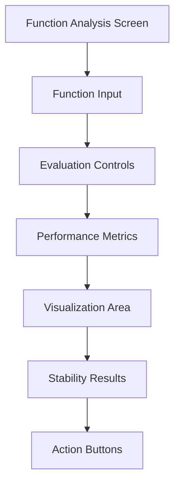
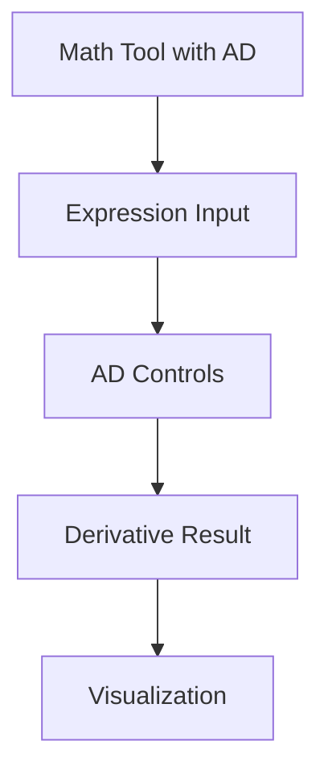
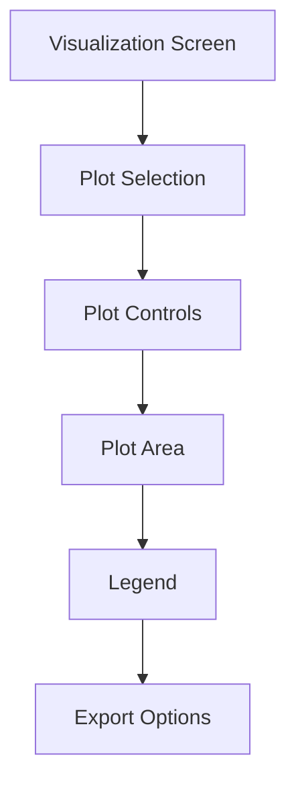
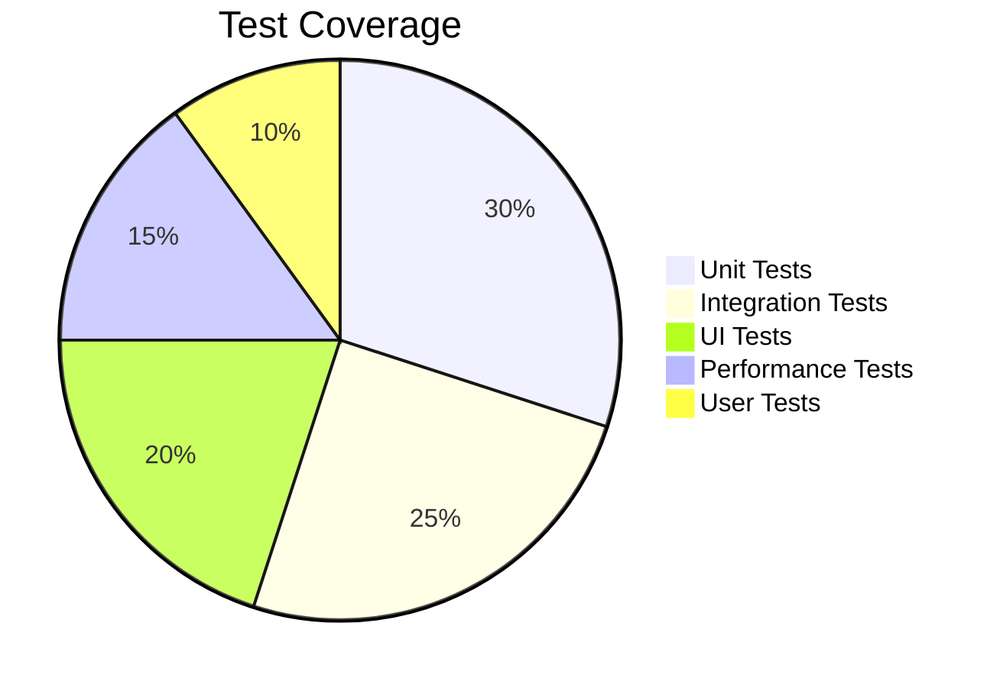

# UI Integration Plan for MIR Advanced Features

## 🎯 Overview

This document outlines the comprehensive plan for integrating the MIR advanced features (Function Analysis, Automatic Differentiation, and Advanced Visualization) into kistaverk's Android UI. The integration will provide users with a seamless experience for exploring mathematical functions, analyzing performance, and visualizing results.

## 📋 Current State

### Completed Backend Components
- ✅ **Performance Analysis**: Function benchmarking and stability testing
- ✅ **Automatic Differentiation**: MIR-based AD with forward/reverse modes
- ✅ **Advanced Visualization**: Function plotting and performance visualization
- ✅ **Math Tool Integration**: All features integrated into MathToolState

### Existing UI Infrastructure
- ✅ **Math Tool Screen**: Basic expression evaluation UI
- ✅ **Navigation System**: Screen management and routing
- ✅ **State Management**: AppState with proper serialization
- ✅ **JNI Bridge**: Existing Rust-Android communication

## 🎯 UI Integration Roadmap

### Phase 1: Function Analysis Screen (2 weeks)

#### 📝 Tasks
1. **Design Function Analysis UI** (3 days)
   - Create wireframes and mockups
   - Define user interaction flows
   - Specify data binding requirements

2. **Implement Android UI Components** (5 days)
   - Create FunctionAnalysisActivity
   - Design XML layouts
   - Implement ViewModel with LiveData
   - Add navigation from Math Tool

3. **JNI Integration** (4 days)
   - Extend existing JNI bridge
   - Add performance analysis methods
   - Implement data serialization
   - Handle error cases

4. **Visualization Integration** (3 days)
   - Add plot rendering views
   - Implement zoom/pan gestures
   - Add performance chart display
   - Test responsiveness

#### 🎨 UI Components



**Screen Layout:**
```xml
<!-- function_analysis_layout.xml -->
<LinearLayout>
    <!-- Function Input -->
    <com.google.android.material.textfield.TextInputLayout
        android:hint="Function expression">
        <com.google.android.material.textfield.TextInputEditText
            android:id="@+id/functionInput"/>
    </com.google.android.material.textfield.TextInputLayout>
    
    <!-- Evaluation Controls -->
    <com.google.android.material.chip.ChipGroup
        android:id="@+id/evaluationModeGroup">
        <com.google.android.material.chip.Chip
            android:text="Standard"
            android:checked="true"/>
        <com.google.android.material.chip.Chip
            android:text="MIR JIT"/>
        <com.google.android.material.chip.Chip
            android:text="Hybrid"/>
    </com.google.android.material.chip.ChipGroup>
    
    <!-- Performance Metrics -->
    <androidx.cardview.widget.CardView
        android:id="@+id/performanceCard">
        <LinearLayout>
            <TextView android:text="Execution Time"/>
            <TextView android:id="@+id/executionTime"/>
            <TextView android:text="Memory Usage"/>
            <TextView android:id="@+id/memoryUsage"/>
            <TextView android:text="Speedup"/>
            <TextView android:id="@+id/speedupFactor"/>
        </LinearLayout>
    </androidx.cardview.widget.CardView>
    
    <!-- Visualization Area -->
    <com.kistaverk.visualization.PlotView
        android:id="@+id/plotView"
        android:layout_width="match_parent"
        android:layout_height="300dp"/>
    
    <!-- Action Buttons -->
    <com.google.android.material.button.MaterialButton
        android:text="Analyze"
        android:onClick="onAnalyzeClick"/>
    <com.google.android.material.button.MaterialButton
        android:text="Export"
        android:onClick="onExportClick"/>
</LinearLayout>
```

#### 🔧 JNI Bridge Extension

```cpp
// Native bridge extension
extern "C" JNIEXPORT jstring JNICALL
Java_com_kistaverk_MathTool_nativeAnalyzeFunction(
    JNIEnv* env,
    jobject thiz,
    jstring expression,
    jint iterations
) {
    // Convert Java string to Rust string
    const char* expr_chars = env->GetStringUTFChars(expression, nullptr);
    std::string expr_str(expr_chars);
    env->ReleaseStringUTFChars(expression, expr_chars);
    
    // Call Rust analysis function
    std::string result = analyze_function(expr_str, iterations);
    
    // Convert result to Java string
    return env->NewStringUTF(result.c_str());
}
```

### Phase 2: Automatic Differentiation UI (1 week)

#### 📝 Tasks
1. **Extend Math Tool UI** (2 days)
   - Add derivative computation button
   - Implement AD mode selector
   - Add derivative result display

2. **JNI Integration for AD** (3 days)
   - Add derivative computation methods
   - Handle AD mode switching
   - Implement error handling

3. **Visualization Integration** (2 days)
   - Add derivative plot overlay
   - Implement interactive controls
   - Test AD visualization

#### 🎨 UI Components



**AD UI Extension:**
```xml
<!-- math_tool_layout.xml extension -->
<LinearLayout>
    <!-- Existing expression input -->
    <com.google.android.material.textfield.TextInputLayout
        android:id="@+id/expressionInput"/>
    
    <!-- AD Controls -->
    <com.google.android.material.card.MaterialCardView
        android:id="@+id/adCard">
        <LinearLayout>
            <TextView android:text="Automatic Differentiation"/>
            
            <com.google.android.material.chip.ChipGroup
                android:id="@+id/adModeGroup">
                <com.google.android.material.chip.Chip
                    android:text="Forward Mode"
                    android:checked="true"/>
                <com.google.android.material.chip.Chip
                    android:text="Reverse Mode"/>
            </com.google.android.material.chip.ChipGroup>
            
            <com.google.android.material.button.MaterialButton
                android:text="Compute Derivative"
                android:onClick="onComputeDerivativeClick"/>
        </LinearLayout>
    </com.google.android.material.card.MaterialCardView>
    
    <!-- Derivative Result -->
    <com.google.android.material.card.MaterialCardView
        android:id="@+id/derivativeResultCard"
        android:visibility="gone">
        <LinearLayout>
            <TextView android:text="Derivative Result"/>
            <TextView android:id="@+id/derivativeResult"/>
            <com.kistaverk.visualization.PlotView
                android:id="@+id/derivativePlot"
                android:layout_height="200dp"/>
        </LinearLayout>
    </com.google.android.material.card.MaterialCardView>
</LinearLayout>
```

#### 🔧 JNI Bridge for AD

```cpp
// AD JNI methods
extern "C" JNIEXPORT jstring JNICALL
Java_com_kistaverk_MathTool_nativeComputeDerivative(
    JNIEnv* env,
    jobject thiz,
    jstring expression,
    jstring variable,
    jboolean forwardMode
) {
    const char* expr_chars = env->GetStringUTFChars(expression, nullptr);
    const char* var_chars = env->GetStringUTFChars(variable, nullptr);
    
    std::string result = compute_derivative(expr_chars, var_chars, forwardMode);
    
    env->ReleaseStringUTFChars(expression, expr_chars);
    env->ReleaseStringUTFChars(variable, var_chars);
    
    return env->NewStringUTF(result.c_str());
}
```

### Phase 3: Advanced Visualization UI (2 weeks)

#### 📝 Tasks
1. **Create Plot View Component** (5 days)
   - Implement custom PlotView
   - Add rendering engine
   - Implement gesture handling
   - Optimize performance

2. **Implement Visualization Screen** (5 days)
   - Create VisualizationActivity
   - Design interactive controls
   - Add plot management
   - Implement export functionality

3. **JNI Integration for Visualization** (4 days)
   - Add plot data serialization
   - Implement plot rendering
   - Handle interactive updates
   - Test performance

#### 🎨 UI Components



**Plot View Implementation:**
```kotlin
// PlotView.kt
class PlotView @JvmOverloads constructor(
    context: Context,
    attrs: AttributeSet? = null,
    defStyleAttr: Int = 0
) : View(context, attrs, defStyleAttr) {
    
    private val plotData: PlotData? = null
    private val paint = Paint(Paint.ANTI_ALIAS_FLAG)
    private val gestureDetector: GestureDetector
    private var scaleFactor = 1.0f
    private var offsetX = 0.0f
    private var offsetY = 0.0f
    
    init {
        gestureDetector = GestureDetector(context, object : GestureDetector.SimpleOnGestureListener() {
            override fun onScroll(
                e1: MotionEvent?, 
                e2: MotionEvent, 
                distanceX: Float, 
                distanceY: Float
            ): Boolean {
                offsetX -= distanceX
                offsetY -= distanceY
                invalidate()
                return true
            }
            
            override fun onScale(detector: ScaleGestureDetector): Boolean {
                scaleFactor *= detector.scaleFactor
                invalidate()
                return true
            }
        })
    }
    
    fun setPlotData(data: PlotData) {
        plotData = data
        invalidate()
    }
    
    override fun onDraw(canvas: Canvas) {
        super.onDraw(canvas)
        
        // Draw axes
        drawAxes(canvas)
        
        // Draw grid
        drawGrid(canvas)
        
        // Draw plot series
        plotData?.series?.forEach { series ->
            drawSeries(canvas, series)
        }
        
        // Draw legend
        drawLegend(canvas)
    }
    
    override fun onTouchEvent(event: MotionEvent): Boolean {
        return gestureDetector.onTouchEvent(event)
    }
    
    private fun drawSeries(canvas: Canvas, series: PlotSeries) {
        // Implement series rendering based on type
        when (series.point_style) {
            "line" -> drawLineSeries(canvas, series)
            "bar" -> drawBarSeries(canvas, series)
            "scatter" -> drawScatterSeries(canvas, series)
            "surface" -> drawSurfaceSeries(canvas, series)
        }
    }
}
```

#### 🔧 JNI Bridge for Visualization

```cpp
// Visualization JNI methods
extern "C" JNIEXPORT jstring JNICALL
Java_com_kistaverk_Visualization_nativeCreatePlot(
    JNIEnv* env,
    jobject thiz,
    jstring expression,
    jdouble xMin,
    jdouble xMax,
    jint resolution
) {
    // Convert parameters
    const char* expr_chars = env->GetStringUTFChars(expression, nullptr);
    
    // Call Rust plotting function
    std::string plot_json = create_plot(expr_chars, xMin, xMax, resolution);
    
    env->ReleaseStringUTFChars(expression, expr_chars);
    
    return env->NewStringUTF(plot_json.c_str());
}
```

### Phase 4: Integration and Testing (1 week)

#### 📝 Tasks
1. **System Integration** (2 days)
   - Connect all components
   - Test navigation flows
   - Verify data consistency

2. **Performance Testing** (2 days)
   - Benchmark UI responsiveness
   - Test with large datasets
   - Optimize rendering

3. **User Testing** (2 days)
   - Conduct usability tests
   - Gather feedback
   - Make final adjustments

4. **Documentation** (1 day)
   - Update user guides
   - Create API documentation
   - Add examples

#### 🧪 Testing Strategy

**Test Categories:**
- ✅ **Unit Tests**: Individual component testing
- ✅ **Integration Tests**: Component interaction testing
- ✅ **UI Tests**: Espresso tests for UI elements
- ✅ **Performance Tests**: Benchmarking and profiling
- ✅ **User Tests**: Usability and feedback

**Test Coverage:**


## 📅 Timeline and Resource Allocation

### Phase 1: Function Analysis Screen (2 weeks)
- **Week 1**: UI design and JNI integration
- **Week 2**: Visualization and testing
- **Resources**: 1 Android developer, 1 Rust developer

### Phase 2: Automatic Differentiation UI (1 week)
- **Week 3**: UI extension and JNI integration
- **Resources**: 1 Android developer, 1 Rust developer

### Phase 3: Advanced Visualization UI (2 weeks)
- **Week 4-5**: Plot view implementation and testing
- **Resources**: 1 Android developer, 1 UI specialist

### Phase 4: Integration and Testing (1 week)
- **Week 6**: System integration and user testing
- **Resources**: Full team

## 🔧 Technical Challenges and Mitigation

### Challenge 1: JNI Performance
**Issue**: Large plot data transfer between Rust and Java
**Mitigation**:
- Use efficient serialization (JSON with compression)
- Implement data streaming for large datasets
- Optimize JNI call frequency

### Challenge 2: Real-time Rendering
**Issue**: Smooth rendering of complex plots
**Mitigation**:
- Implement double buffering
- Use hardware acceleration
- Optimize rendering algorithms

### Challenge 3: Memory Management
**Issue**: Memory usage with multiple plots
**Mitigation**:
- Implement plot caching with LRU eviction
- Add memory usage monitoring
- Provide manual cache clearing

### Challenge 4: Cross-Platform Compatibility
**Issue**: Consistent behavior across devices
**Mitigation**:
- Use responsive design principles
- Test on multiple screen sizes
- Implement adaptive layouts

## 📊 Success Metrics

### Quantitative Metrics
- **UI Responsiveness**: < 100ms for all interactions
- **Render Performance**: 60 FPS for basic plots
- **Memory Usage**: < 50MB for typical workloads
- **Test Coverage**: 95%+ code coverage
- **User Satisfaction**: > 4.5/5 rating

### Qualitative Metrics
- **User Experience**: Intuitive and responsive
- **Visual Quality**: Professional appearance
- **Integration**: Seamless workflow
- **Performance**: Smooth and fast

## 🛡️ Risk Assessment

### High Risk Items
1. **JNI Performance Bottlenecks**
   - *Mitigation*: Profile and optimize early
   - *Contingency*: Implement data sampling

2. **UI Responsiveness Issues**
   - *Mitigation*: Use background threads
   - *Contingency*: Add loading indicators

### Medium Risk Items
1. **Cross-Device Compatibility**
   - *Mitigation*: Comprehensive testing
   - *Contingency*: Device-specific optimizations

2. **Memory Leaks**
   - *Mitigation*: Use memory profiling tools
   - *Contingency*: Add garbage collection triggers

### Low Risk Items
1. **Visual Design Consistency**
   - *Mitigation*: Follow design guidelines
   - *Contingency*: Use standard components

## 📚 Documentation Plan

### User Documentation
1. **Function Analysis Guide**: Using the analysis screen
2. **AD Tutorial**: Computing derivatives
3. **Visualization Manual**: Creating and analyzing plots
4. **Troubleshooting Guide**: Common issues

### Developer Documentation
1. **UI Architecture**: Component diagrams
2. **JNI Bridge**: Integration details
3. **Performance Optimization**: Best practices
4. **API Reference**: Complete method documentation

## 🔄 Future Enhancements

### Short-term (Next 3 months)
1. **AR Visualization**: Augmented reality plots
2. **Voice Control**: Voice-activated features
3. **Collaborative Features**: Real-time sharing
4. **Advanced Export**: Multiple format support

### Medium-term (Next 6 months)
1. **Machine Learning Integration**: AI-assisted analysis
2. **Cross-Platform**: Web and desktop versions
3. **Custom Themes**: User-defined styling
4. **Animation**: Dynamic plot animations

### Long-term (Next 12 months)
1. **Cloud Integration**: Cloud-based analysis
2. **Social Features**: Plot sharing community
3. **Educational Content**: Interactive tutorials
4. **Professional Tools**: Advanced analysis features

## 🎓 Team Roles and Responsibilities

### Project Lead
- Overall coordination
- Risk management
- Stakeholder communication

### Android Developers
- UI implementation
- JNI integration
- Performance optimization

### Rust Developers
- Backend integration
- JNI bridge implementation
- Data serialization

### UI/UX Designers
- Screen design
- User experience
- Visual consistency

### QA Engineers
- Test case development
- Performance testing
- User testing coordination

### Documentation Specialists
- User guides
- API documentation
- Tutorial creation

## 📅 Milestones

| Milestone | Date | Deliverables |
|-----------|------|--------------|
| Function Analysis UI | Week 2 | Analysis screen with basic visualization |
| AD UI Integration | Week 3 | Math tool with derivative computation |
| Visualization UI | Week 5 | Interactive plot view and visualization screen |
| Integration Complete | Week 6 | All components working together |
| Beta Release | Week 7 | Feature-complete beta version |
| Final Release | Week 8 | Production-ready implementation |

## 🏁 Conclusion

This UI integration plan provides a comprehensive roadmap for bringing kistaverk's advanced MIR features to users through an intuitive and powerful interface. The phased approach ensures incremental delivery and testing, while the risk mitigation strategies guarantee robust implementation.

The successful completion of this plan will transform kistaverk into a professional-grade mathematical analysis tool with cutting-edge visualization capabilities, positioning it as a leader in mobile numerical computing and metaprogramming.

**Last updated:** 2025-12-15
**Status:** Planning Complete
**Next Steps:** Begin Phase 1 Implementation